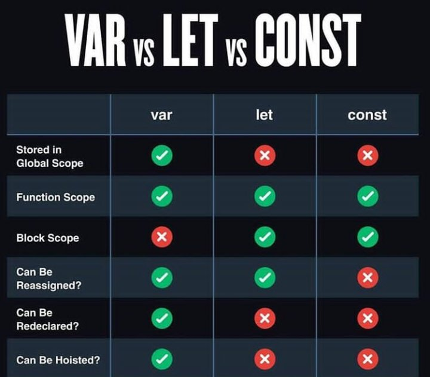
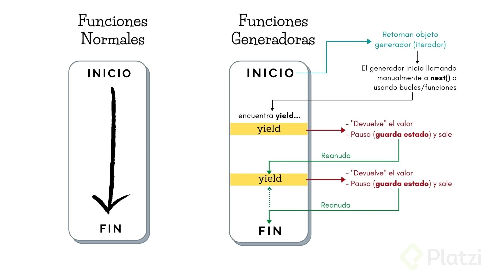

# Curso de ECMAScript 6+

[https://platzi.com/cursos/ecmascript-6/](https://platzi.com/cursos/ecmascript-6/)
Prof: Oscar Barajas Tavares

## Qué es ECMAScript

ECMAScript es la especificación del lenguaje JavaScript propuesto por ECMA Internacional, que es la institución encargada de los estándares, y JavaScript, es el lenguaje de programación que utiliza las especificaciones propuestas, que van siendo añadidas cada año a partir del 2015, cuando fue lanzado ES6.

ECMA es una institución que dicta estándares o funcionalidades que deben adaptarse o añadirse a los engines de Js. Puesto que Js es un lenguaje interpretado y con muchos motores que lo interpretan/compilan, se vió la necesidad de hacer un estándar que todos esos motores siguieran, para tener consistencia en nuestros desarrollo a lo largo de todos los navegadores.

Esto nos ha permitido no solo tener funcionalidades nuevas, si no también que funcione de la misma manera en donde sea que corramos nuestro proyecto. Aunque también es importante decir, que por ser un estándar y no una empresa que está detrás del desarrollo del motor de js en sí, se suele tardar meses incluso años en ver reflejadas las nuevas características en los motores, o ver que esas características llegan primero a uno y luego a otros. Como el caso de Node.js, que incluso 5 años después de ECMAScript 2015 (ES6), aún no podemos usar ECMA import/export en él de manera normal.

## Default Params y Concatenación

ES6 - Parámetros por defecto

```jsx
// Antes
function newFunction(name, age, country) {
  var name = name || "Soter";
  var age = age || 27;
  var country = country || "MX";
  console.log(name, age, country);
}
// Ahora
function newFunction2(name = "Soter", age = 27, country = "MX") {
  console.log(name, age, country);
}
// Ejecución
newFunction2(); //llamamos lo que tenemos de datos
newFunction2("Ricardo", "23", "CO"); // ingresamos datos
```

Concatenación (template litrals)

```jsx
// Antes
let hello = "Hello";
let world = "World";
let epicFrase = hello + " " + world;
console.log(epicFrase);

//El resultado a mostrar es: Hello World , en la consola

let epicFrase2 = `${hello} ${world}`;
console.log(epicFrase2);
```

Cuando usamos esta “expresion” **${ }** estamos interpolando datos, no necesariamente solo admite variables, sino que ahí se puede aplicar metodos, por ejemplo.

```jsx
let nama = "Daniel";
let lastName = "Molina";

let str = `Hola, me llamo ${name.toUpperCase()} ${lastName.toLowerCase()}`;
```

## LET y CONST, Multilínea, Spread Operator y Desestructuración

Multilínea

```jsx
/**
 * Multiline
 */
// Antes
let lorem =
  "Mollit ea veniam ad magna. Voluptate qui commodo do commodo el officia. \n" +
  "Sit quis mollit esse quis reprehenderit labore esse nisi.";
console.log("Before ES6 -> ", lorem);

// es6
let loremES6 = `Velit aliqua culpa nisi aute nulla sit.
Reprehenderit deserunt id officia excepteur excepteur
adipisicing ut sit enim dolor laboris nulla exercitation.`;
console.log(`After ES6 -> ${loremES6}`);
```

Desestructuración

```jsx
/**
 * Destructuring
 */
// Antes
let person = {
  name: "Oscar",
  age: "32",
  country: "MX",
};
console.log("Before ES6 -> ", person.name, person.age, person.country);

// es6
let { name, age, country } = person;
console.log(name, age, country);
```

Spread Operator

```jsx
/**
 * Spread Operator
 */
// Antes
let team1 = ["Oscar", "Julián", "Ricardo"];
let team2 = ["Valeria", "Yeasica"];
let education = ["David", "Oscar", "Julián", "Ricardo", "Valeria", "Yeasica"];
console.log("Before ES6 -> ", education);

let educationES6 = ["David", ...team1, ...team2];
console.log(`After ES6 -> ${educationES6}`);
```

Var, Let and Const

```jsx
/**
 * Var, Let and Const
 */
{
  var globalVar = 'Global Var';
}
{
  let globalLet = 'Global Let';
  const globalConst = 'Global Const';
}
console.log(globalVar);
console.log(globalLet); => Error
console.log(globalConst);  => Error
```



## Arrow Functions, Promesas y Parámetros en objetos

Objetos mejorados

```jsx
let name = "nombre";
let age = 45;

// Antes
const persona = { name: name, age: age };

// ES6
const persona = { name, age };
```

Arrow Functions

```jsx
/**
 * Arrow Functions
 */
const names = [
  { name: 'Oscar', age: 32 },
  { name: 'Yesica', age: 27 }
];

// Antes
let listOfNames = names.map(function(item) {
  console.log(item.name);
});

// es6
let listOfNamesES6 = names.map(item => console.log(item.name));

const listOfNames3 = (name, age, country) => {
...
}

const listOfNames4 = name => { ... }

const squeare = num => num * num;
```

Promesas

```jsx
/**
 * Promises
 */

const helloPromise = (foo) => {
  return new Promise((resolve, reject) => {
    if (foo) {
      resolve("Hey!");
    } else {
      reject("Upss!");
    }
  });
};

const foo = false;
helloPromise(foo)
  .then((response) => console.log("response -> ", response))
  .then(() => console.log("message -> Hello World!"))
  .catch((error) => console.log("error -> ", error));
```

## Clases, Módulos y Generadores

Clases

```jsx
/**
 * Classes
 */
class Calculator {
  constructor() {
    this.valueA = 0;
    this.valueB = 0;
  }

  sum(valueA, valueB) {
    this.valueA = valueA;
    this.valueB = valueB;
    return this.valueA + this.valueB;
  }
}

const calc = new Calculator();
console.log("Calc Result -> ", calc.sum(2, 3));
```

Modules

Puedes importar uno o más objetos o valores utilizando el nombre que se le definió en el módulo y que se haya declarado con la palabra clave `export`. Ejemplo:

```jsx
// module.js
export const myExport = "hola";

// index.js
import { myExport } from "module.js";
```

**Importación predeterminada (default)**

Cuando el módulo tiene una exportación predeterminada (default) omitimos el uso de llaves al momento de importar. Ejemplo:

```jsx
// module.js
function myFunction() {...}
export default myFunction

// index.js
import myFunction from "module.js"
```

Para importar los dos tipos de exportaciones podemos separarlos por comas. Ejemplo:

```jsx
// module.js
export const myExport = "hola"
function myFunction() {}

export default myFunction

// index.js
import myFunction, { myExport }
```

Generators

```jsx
/**
 * Generators - Guarda estado
 **/
function* helloWorld() {
  if (true) {
    yield "Hello, ";
  }
  if (true) {
    yield "World!";
  }
}
const generatorHello = helloWorld();
console.log(generatorHello.next().value); // Hello
console.log(generatorHello.next().value); // World
console.log(generatorHello.next().value); // undefined
```



## ¿Qué se implementó en ES7?

```jsx
/**
 * Includes - Antes se utilizaba indexOf
 */
let numbers = [1, 2, 3, 7, 8];
const VALUE = 7;

if (numbers.includes(VALUE)) {
  console.log(`Sí se encuentra el valor ${VALUE}`);
} else {
  console.log(`No se encuentra el valor ${VALUE}`);
}

/**
 * Pow
 */
let base = 4;
let exponent = 4;
let result = base ** exponent;
console.log(`Result -> ${result}`);
```

## ¿Qué se implementó en ES8?

```jsx
// Object.entries (+agregado)
// Devuelve la clave y valores

const data = {
  frontend: "Oscar",
  backend: "Isabel",
  design: "Ana",
};

// -entries- { Transforma un objeto a matriz }
const entries = Object.entries(data);
console.log(entries);
// [
//    ['frontend': 'Oscar'],
//	  [backend: 'Isabel'],
//    [design: 'Ana']
// ]
console.log(entries.length); // 3

// -values- { Toma sólo los valores, pasándolos a un Array }
const values = Object.values(data);
console.log(values); // ['Oscar', 'Isabel', 'Ana']
console.log(values.length); // 3

/***********/
/* Padding */
/***********/
// padStart & padEnd (Agregan caracteres al princio y al
// final respectivamente, toman 2 parametros (limite, string))

const myString = "hello";

console.log(myString.padStart(8, "hi ")); // hi, hello
console.log(myString.padEnd(12, " _____")); // hello _____
```

## Async Await

[https://www.youtube.com/watch?v=E5ENWEcoDdI](https://www.youtube.com/watch?v=E5ENWEcoDdI)

```jsx
const helloWorld = () => {
  return new Promise((resolve, reject) => {
    true
      ? setTimeout(() => resolve("helloWorld"), 3000)
      : reject(new Error("Test Error"));
  });
};

const helloAsync = async () => {
  const hello = await helloWorld();
  console.log(hello);
};

helloAsync();

//Nos permitirá usar trycatch y trabajar los errores correctamente.

const another = async () => {
  try {
    const hello = await helloWorld();
    console.log(hello);
  } catch (error) {
    console.log(error);
  }
};

another();
```

## ¿Qué se implementó en ES9?

```jsx
/**
 * Spread Operator
 */
const obj = {
  name: "Oscar",
  age: 32,
  country: "MX",
};

let { name, ...addInfo } = obj;
console.log(`name: ${name}`);
console.log(`additional information: `, addInfo);

let { country, ...nameAndAge } = obj;
console.log(`name and age: `, nameAndAge);

/**
 * Porpagation Properties
 */
const person = {
  name: "Oscar",
  age: 32,
};

const personInformation = {
  ...person,
  country: "MX",
};
console.log(`personInformation: `, personInformation);

/**
 * Promise Finally
 */
const helloWorld = () => {
  return new Promise((resolve, reject) => {
    true
      ? setTimeout(() => {
          resolve("Hello World!");
        }, 3000)
      : reject(new Error("Test Error"));
  });
};

helloWorld()
  .then((result) => console.log("result -> ", result))
  .catch((err) => console.log("err -> ", err))
  .finally(() => console.log("finalizó"));

/**
 * Regex
 */
const regexData = /([0-9]{4})-([0-9]{2})-([0-9]{2})/;
const match = regexData.exec("2018-04-28");
const year = match[1];
const month = match[2];
const day = match[3];
console.log("Date -> ", year, month, day); // Date -> 2018 04 28
```

## ¿Qué se implementó en ES10?

```jsx
//--------------method flat---------------/
//devolver una matriz con una submatriz aplanada,
//recibe como argunmento la profundidad
let array = [1, 2, 3, [1, 2, 3, [1, 2, 3]]];

console.log(array.flat(2));

//-------------flatMap---------------------------/
//mapear cada elemento, luego pasarle una funcion y aplanar

let array = [1, 2, 3, 4, 5];

console.log(array.flatMap((value) => [value, value * 2]));

//----------------trim---------------------------/
let hello = "                      hello world";
console.log(hello);
console.log(hello.trimStart()); // inicio

let hello = "hello world                  ";
console.log(hello);
console.log(hello.trimEnd()); // final

//-------------optional catch biding-------------/

try {
} catch /*(error) ya no es necesario colocarlo*/ {
  error;
}

//-------------fromEntries----------------------/
// array to object
let entries = [
  ["name", "oscar"],
  ["age", 32],
];
console.log(Object.fromEntries(entries));

//-------------symbol object--------------------/
let mySymbol = "My Symbol";
let symbol = Symbol(mySymbol);
console.log(symbol.description);
```

## ECMAScript 2020

**Dynamic import ( importación dinámica)**

- Permite llamar nuestro código cuando lo necesitemos.
- El archivo no se va a cargar de manera automatica.
- Con esto podremos dividir nuestro codigo y evitar que la app sea muy grande.
- Por todo lo anterior, mejora la performance.

**Codigo usando durante la clase:**

```html
<!-- Archivo index.html -->
<!DOCTYPE html>
<html lang="en">
  <head>
    <meta charset="UTF-8" />
    <meta http-equiv="X-UA-Compatible" content="IE=edge" />
    <meta name="viewport" content="width=device-width, initial-scale=1.0" />
    <title>Document</title>
  </head>
  <body>
    <button id="btn">File</button>
    <script type="module" src="index.js"></script>
  </body>
</html>
```

```jsx
// Archivo index.js
//dynamic import: podremos realizar importacion dinamica de piezas de codigo
const button = document.getElementById("btn");

button.addEventListener("click", async function () {
  const module = await import("./file.js");
  module.hello();
});
```

```jsx
// Archivo file.js
export function hello() {
  console.log("hola mundo");
}
```

## ECMAScript 2020 - características importantes

```jsx
// 🔢 Big INT: permite trabajar con numeros mayores a 2^53

// 1- Añadiendo una "n" al final activas el big int en el valor
const aBigNumber = 9007199254740991n;

// 2- Con el metodo BigInt activas el valor
const anotherBigNumber = BigInt(9007199254740991);

console.log(aBigNumber);
console.log(anotherBigNumber);

// 🤝 Promise All Settled

const promise1 = new Promise((resolve, reject) => reject("reject"));
const promise2 = new Promise((resolve, reject) => resolve("resolve"));
const promise3 = new Promise((resolve, reject) => resolve("resolve 1"));

Promise.allSettled([promise1, promise2, promise3]).then((response) =>
  console.log(response)
);

/* Promise all se rechaza donde se rechaza una de sus promesas, en
cambio allSettled, no importa el resultado, solo espera el final
[
  { status: 'rejected', reason: 'reject' },
  { status: 'fulfilled', value: 'resolve' },
  { status: 'fulfilled', value: 'resolve 1' }
]
*/

// 🌎 Global This

console.log(window);
console.log(globalThis);

// 🔍 Nuevo operador lógico: null operator

const fooo = null ?? "default string";
console.log(fooo);

const fooo2 = "not null" ?? "default string";
console.log(fooo2);

// ⛓ Optional chaining

const user = {};
console.log(user?.profile?.email);

if (user?.profile?.email) {
  console.log("email");
} else {
  console.log("fail");
}
```

## ECMAScript 2021

ReplaceAll

El método `replaceAll()` devuelve una nueva cadena con todas las coincidencias de un patrón reemplazadas. El patrón puede ser una cadena o RegExp, y el reemplazo puede ser una cadena o una función que se llamará para cada coincidencia.

```jsx
const string =
  "JavaScript es maravilloso, con JavaScript puedo crear el futuro de la web.";

const replacedString = string.replace("JavaScript", "Python");
console.log(replacedString);
// Python es maravilloso, con JavaScript puedo crear el futuro de la web.

const replacedString2 = string.replaceAll("JavaScript", "Python");
console.log(replacedString2);
// Python es maravilloso, con Python puedo crear el futuro de la web.
```

Métodos privados

```jsx
class Message {
  #show(val) {
    // Con el # convertimos al método en privado
    console.log(val);
  }
}

const message = new Message();
message.show("Hola!");
```

Promise Any

El método `Promise.any` recibe un array de promesas y se resuelve tan pronto como una de ellas haya sido resuelta. El valor del resultado va a ser esa primera promesa resuelta.

```jsx
const promise1 = new Promise((resolve, reject) => reject("1"));
const promise2 = new Promise((resolve, reject) => resolve("2"));
const promise3 = new Promise((resolve, reject) => resolve("3"));

Promise.any([promise1, promise2, promise3]).then((response) =>
  console.log(response)
);
```

WeakRef

Un objeto WeakRef le permite mantener una referencia débil a otro objeto, sin evitar que ese objeto sea recolectado como basura.

```jsx
class AnyClass {
    constructor(element){
        this.ref = new WeakRef
    }
    {...}
}
```

Nuevos operadores lógicos

```jsx
let isTrue = true;
let isFalse = false;
console.log((isTrue &&= isFalse)); // false

let isTrue = true;
let isFalse = false;
console.log((isTrue ||= isFalse)); // true

let isTrue = undefined;
let isFalse = false;
console.log((isTrue ??= isFalse)); // false
```
