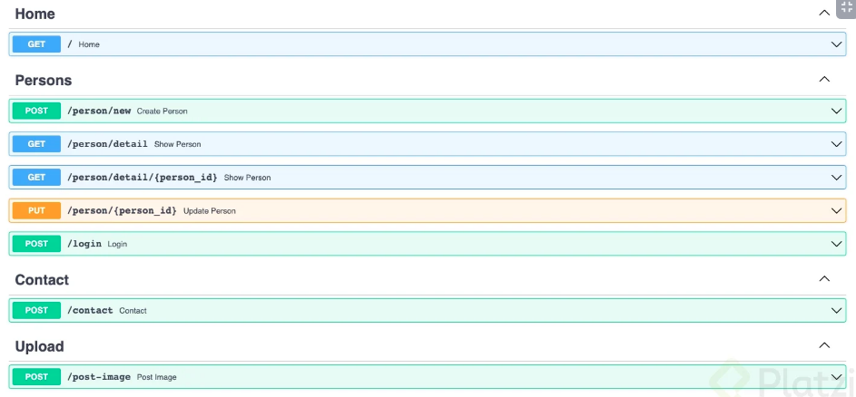
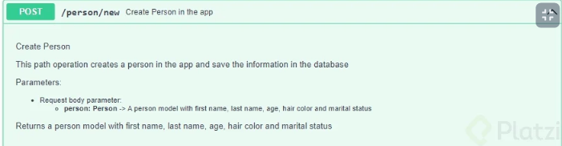

# FastAPI: Fundamentos, Path Operations y Validaciones

https://platzi.com/cursos/fastapi/
prof: Facundo García Martoni

## ¿Qué es FastAPI?

<font color="green">FastAPI</font>, es el framework más veloz para el desarrollo web con Python, particularmente backend, APIS. Es un o de los frameworks más rápidos, compite con GO.

Creado por Sebastián Ramirez (@tiangolo). Es open source.

## Ubicación de FastAPI en el ecosistema de Python

<u>FastAPI utiliza otros frameworks dentro de si para funcionar</u>

- **Uvicorn**: es una librería de Python que funciona de servidor, es decir, permite que cualquier computadora se convierta en un servidor

- **Starlette**: es un framework de desarrollo web de bajo nivel, para desarrollar aplicaciones con este requieres un amplio conocimiento de Python, entonces FastAPI se encarga de añadirle funcionalidades por encima para que se pueda usar mas fácilmente

- **Pydantic**: Es un framework que permite trabajar con datos similar a pandas, pero este te permite usar modelos los cuales aprovechara FastAPI para crear la API

FastAPI es un framework que está parado sobre los hombros de gigantes, esos gigantes son Uvicorn, Starlette y Pydantic.

## Hello World: creación del entorno de desarrollo

1. Crear carpeta llamada fast-api-hello-word

`cd fast-api-hello-word`

2. Crear entorno virtual

`py -m venv venv`

3. activar entorno virtual

`source venv/bin/activate`

4. Instalamos fastapi y el servidor uvicorn

`pip install fastapi uvicorn`

5. `Code .` Creamos un archivo llamado `main.py`

6. `git init`

7. Crear el archivo `.gitignore` y agregar:

`venv/`

8. `git add .` y `git commit -m "First commit"`

## Hello World: elaborando el código de nuestra primer API

```python
# main.py
from fastapi import FastAPI

app = FastAPI()

@app.get("/")
def home():
    return {"Hellow": "word"}
```

Levantamos el servidor desde la terminal:

```bash
$uvicorn main:app --reload
```

## Documentación interactiva de una API

FastAPI documenta el código correctamente. Está parado sobre los hombros de <font color="violet">OpenAPI (es una especificación), el cual es un conjunto de reglas que permite definir cómo describir, crear y visualizar APIs. Es un conjunto de reglas que permiten decir que una API está bien definida</font>

OpenAPI necesita de un software, el cual es Swagger, que es un conjunto de softwares que permiten trabajar con APIs. FastAPI funciona sobre un programa de Swagger el cual es Swagger UI, que permite mostrar la API documentada en html

- Acceder a la documentación interactiva con Swagger UI: localhost/docs
- Acceder a la documentación interactiva con Redoc: localhost/redoc

## Path Operations

<u>¿Que es un path (route, endpoint)?</u> Un path es lo mismo que un route o endpoints y es todo aquello que vaya después de nuestro dominio a la derecha del mismo.

<u>¿Que son las operations?</u> Un operations es exactamente lo mismo que un método http y tenemos las siguientes más populares: GET, POST, PUT, DELETE, OPTIONS, HEAD, PATCH …

- GET solicita una representación del recurso especificado. Las solicitudes que utilizan GET solo deben recuperar datos.
- HEAD solicita una respuesta idéntica a GET, pero sin el cuerpo de la respuesta.
- POST envía una entidad al recurso especificado, lo que a menudo provoca un cambio de estado o efectos secundarios en el servidor.
- PUT reemplaza todas las representaciones actuales del recurso de destino con la carga útil de la solicitud.
- DELETE elimina el recurso especificado.
- CONNECT establece un túnel al servidor identificado por el recurso de destino.
- OPTIONS describe las opciones de comunicación para el recurso de destino.
- TRACE realiza una prueba de bucle de mensajes a lo largo de la ruta al recurso de destino.
- PATCH aplica modificaciones parciales a un recurso.

## Path Parameters

<u>Path Parameters</u> Podemos crear variables dentro de los endpoints, se les llama Path Parameters. Si yo los defino, entonces es obligatorio usarlos.

Por ejemplo: /tweets/{tweet_id}

## Query Parameters

<u>Query Parameters</u>: es un conjunto de elementos opcionales los cuales son añadidos al finalizar la ruta, con el objetivo de definir contenido o acciones en la url, estos elementos se añaden despues de un ?
para agregar más query parameters utilizamos &

Ej: `PUT /users/{user_id}/details?age=20&heiht=184`

## Request Body y Response Body

<u>Request Body y Response Body</u>

Debes saber que bajo el protocolo HTTP existe una comunicación entre el usuario y el servidor. Esta comunicación está compuesta por cabeceras (headers) y un cuerpo (body).

Se tienen dos direcciones en la comunicación entre el cliente y el servidor y definen de la siguiente manera:

- Request : Cuando el cliente solicita/pide datos al servidor.
- Response : Cuando el servidor responde al cliente.
- Request Body: es el cuerpo (body) de una solicitud del cliente al servidor.
- Response Body: es el cuerpo (body) de una respuesta del servidor al cliente.

---

En nuestro proyecto creamos una rama:

```bash
$git checkout -b "request_response_body"
$git branch
```

Luego creamos una ruta:

```python
@app.post("/person/new")
def create_person():
    ...
```

## Models

- Entidad: es cualquier objeto que nos rodea
- Modelo: es la representación de una entidad en código, al menos de manera descriptiva, por lo que cada entidad debe tener por lo menos un modelo. Esto se logra con una librería llamada pydantic, de ella traeremos una clase llamada BaseModel para crear los modelos.

<u>Cómo creamos los modelos</u>:

```python
# Haremos tipado estático
from typing import Optional

from pydantic import Base model

from fastapi import Body

class Person(BaseModel):
    first_name: str
    last_name: str
    age: int
    hair_Color: Optional[str] = None
    is_married: Optional[bool] = None

@.app.post("/person/new")
def_create_person(person: Person = Body(...)):
    return person

# Body Lo utilizamos para indicar qque el parámetro Person es de tipo body.
# Además el ... indica que es obligatorio
```

## Validaciones: Query Parameters

<u>Validaciones</u> Las validaciones tal como se definen, nos sirven para comprobar si son correctos los parámetros entregados en cada una de las peticiones. Estas validaciones funcionan restringiendo o indicando el formato de entrega en cada una de las peticiones.

<u>Query parameters</u> Entonces, se definen las validaciones para las Query Parameters para definir un estándar de consulta y especificar cómo se deben entregar los datos.

Ej: Se define la siguiente consulta (QUERY):

`https://domain.com/user/detail?nombre=Manolo&edad=20`

Como validaciones tendríamos que limitar el tamaño de caracteres que puede tener el atributo “nombre” (50 > largo > 1), además de limitar los valores para “edad” (300 > edad > 0).

```python
from fastapi import Body, Query
# Validaciones: query parameters.

@mi_app.get("/user/detail") # Ruta para realizar la consulta.
def show_user(# opcional (parametros=default, longitud mínima, longitud máxima)
    nombre: Optional[str] = Query(None, min_length=1, max_length=50),
	# Obligatorio.
	edad: int = Query(...)
   ):

   return {nombre: edad};
```

## Validaciones: explorando más parameters

Para especificar las validaciones, debemos pasarle como parámetros a la función Query lo que necesitemos validar.

<u>Para tipos de datos str</u>:

- max_length : Para especificar el tamaño máximo de la cadena
- min_length : Para especificar el tamaño minimo de la cadena
- regex : Para especificar expresiones regulares

<u>Para tipos de datos int</u>:

- ge : (greater or equal than ≥) Para especificar que el valor debe ser mayor o igual
- le : (less or equal than ≤) Para especificar que el valor debe ser menor o igual
- gt : (greater than >) Para especificar que el valor debe ser mayor
- lt : (less than <) Para especificar que el valor debe ser menor

Ej:

```python
# Validaciones de un nombre de usuario.
Query(None, min_length=1, max_length=50)):
```

Validar un email:

.+ = Obliga a contener uno o mas caracteres  
@ = Obliga a tener un @  
. = Obliga a tener un .

```python
email: str = Query(..., regex=".+@.+\..+")
```

Es posible dotar de mayor contexto a nuestra documentación. Se deben usar los parámetros title y description.

- title : Para definir un título al parámetro.
- description : Para especificar una descripción al parámetro.

```python
# Validaciones para un Identificador.
Query(
	None,
	title="ID del usuario",
	description="El ID se consigue entrando a las configuraciones del perfil");
```

## Validaciones: Path Parameters

También podemos aplicar validaciones sobre los path parameters.

Ejemplo:

```python
from fastapi import Body, Query, Path

# Validaciones: Query Parameters

@app.get("/person/detail")
def show_person(
    name: Optional[str] = Query(
        None,
        min_length=1,
        max_length=50,
        title="Person Name",
        description="This is the person name. It's between 1 and 50 characters"
        ),
    age: str = Query(
        ...,
        title="Person Age",
        description="This is the person age. It's required"
        )
):
    return {name: age}

# Validaciones: Path Parameters

@app.get("/person/detail/{person_id}")
def show_person(
    person_id: int = Path(..., gt=0)
):
    return {person_id: "It exists!"}
```

## Validaciones: Request Body

Finalmente podemos validar los parámetros que lleguen en el body del request.

```python
# Validaciones: Request Body
# Models

class Location(BaseModel):
    city: str
    state: str
    country: str

class Person(BaseModel):
    first_name: str
    last_name: str
    age: int
    hair_color: Optional[str] = None
    is_married: Optional[bool] = None

# Routes

@app.put("/person/{person_id}")
def update_person(
    person_id: int = Path(
        ...,
        title="Person ID",
        description="This is the person ID",
        gt=0
    ),
    person: Person = Body(...),
    location: Location = Body(...)
):
    results = person.dict()
    results.update(location.dict())
    return results
```

- dict -> de json a diccionario
- update -> combina diccionarios

> Si necesitamos recibir 2 jsons como input se especifican separadod en la declaración del path pero FastApI lo organiza de la siguiente manera:

```json
body: {
  "person": {
    ...
  },
  "location": {
    ...
  }
}
```

## Validaciones: Models

Podemos validar los atributos que se encuentran dentro del request body. Se realiza dentro del modelo.

Agregamos validaciones a los modelos que teníamos.

> Nota: ver el modelo hair_color. Al inicio del modelo crea un enum con los colores posibles. Luego, en la definición del atributo colocamos que es del tipo enum creado.

```python
#Python
from typing import Optional
from enum import Enum
#Pydantic
from pydantic import BaseModel
from pydantic import Field
#FastAPI
from fastapi import FastAPI
from fastapi import Body, Query, Path

app = FastAPI()
# Models

class HairColor(Enum):
    white = "white"
    brown = "brown"
    black = "black"
    blonde = "blonde"
    red = "red"

class Location(BaseModel):
    city: str
    state: str
    country: str

class Person(BaseModel):
    first_name: str = Field(
        ...,
        min_length=1,
        max_length=50,
        example="Miguel"
        )
    last_name: str = Field(
        ...,
        min_length=1,
        max_length=50,
        example="Torres"
        )
    age: int = Field(
        ...,
        gt=0,
        le=115,
        example=25
    )
    hair_color: Optional[HairColor] = Field(default=None, example=HairColor.black)
    is_married: Optional[bool] = Field(default=None, example=False)
```

## Tipos de datos especiales

Todos estos tipos de datos corresponden a Pydantic, se pueden importar al igual que Field.

<u>Tipos de datos clásicos</u>:

- str → Cadena de texto
- int → Número entero
- float → Número flotante (decimal)
- bool → Booleano

<u>Tipos de datos exóticos</u>:

- Enum → Enumerar caracteres
- HttpUrl → Revisa si una URL es valida (https://myapp.com, www.google.com)
- FilePath → Valida si la ruta que envía el cliente es un archivo (c:/windows/system32/432.dll)
- DirectoryPath → Valida si la ruta que envía el cliente es un directorio (/mnt/c/someFolder)
- EmailStr → Valida si el cliente ingresa un email (hola@email.com)
- PaymentCardNumber → Valida si el cliente ingresa un número de tarjeta
- IPvAnyAdress → Valida si el cliente ingresa una dirección IP
- NegativeFloat → Valida si el cliente ingresa un número negativo de tipo flotante
- PositiveFloat → Valida si el cliente ingresa un número positivo de tipo flotante
- NegativeInt → Valida si el cliente ingresa un número entero negativo
- PositiveInt → Valida si el cliente ingresa un número entero positivo

Para más tipos de datos se puede revisar la documentación de Pydantic. https://pydantic-docs.helpmanual.io/usage/types/#pydantic-types

## Creando ejemplos de Request Body automáticos

El sistema de autodocumentación de Swagger (localhost/docs) nos permite probar cada endpoint. Es bastante psado tener que "llenar" un json con cada ejecución, por que FastAPI nos permite incorporar una subclase dentro de cada modelo para que se autocomplete la documentación de manera de no tener que ingresar todos los datos al JSON.

```python
class Person(BaseModel):
    first_name: str = Field(
        ...,
        min_length=1,
        max_length=50,
        example="Miguel"
        )
    last_name: str = Field(
        ...,
        min_length=1,
        max_length=50,
        example="Torres"
        )
    age: int = Field(
        ...,
        gt=0,
        le=115,
        example=25
    )
    hair_color: Optional[HairColor] = Field(default=None, example=HairColor.black)
    is_married: Optional[bool] = Field(default=None, example=False)

    #class Config:
    #    schema_extra = {
    #        "example": {
    #            "first_name": "Facundo",
    #            "last_name": "García Martoni",
    #            "age": 21,
    #            "hair_color": "blonde",
    #            "is_married": False
    #        }
    #    }
```

Otra forma es no utilizar esta clase particular. Debemos incorporar la llave example en la definición del campo. En el ejemplo, en el campo name coloco "Facundo" y en last_name = "Torres", age=25....

## Creando ejemplos de Path y Query parameters automáticos

También podemos crear ejemplos para las rutas y parámetros. Se utiliza la sintaxis example en la definición del path

<u>Validaciones: Query Parameters</u>

```python
@app.get("/person/detail")
def show_person(
    name: Optional[str] = Query(
        None,
        min_length=1,
        max_length=50,
        title="Person Name",
        description="This is the person name. It's between 1 and 50 characters",
        example="Rocío"
        ),
    age: str = Query(
        ...,
        title="Person Age",
        description="This is the person age. It's required",
        example=25
        )
):
    return {name: age}

# Validaciones: Path Parameters

@app.get("/person/detail/{person_id}")
def show_person(
    person_id: int = Path(
        ...,
        gt=0,
        example=123
        )
):
    return {person_id: "It exists!"}
```

## Response Model

Para realiza una aplicación segura debemos tener dos temas en cuenta a la hora de la creación de la contraseña

- La contraseña no se le envía al cliente
- La contraseña no se almacena en texto plano

<u>Response Model</u>:

Es un atributo de nuestro path operation. Es llamado desde nuestro Path Operation Decorator, el cual es utilizado para evitar el filtrado de información sensible. Definimos un nuevo modelo eliminando los atributos que no deseamos retornar.

Una buena práctica es generar un modelo Base con atributos generales e ir heredando de este para ir agregando que atributos extra necesitamos, por ejemplo BaseUser no contiene el password, y CreationUser que hereda de BaseUser solo agregaría el password dentro de ella, así se organiza un poco mejor los modelos.

```python
@app.post("/person/new", response_model=PersonOut)
def create_person(person: Person = Body(...)):
    return person
```

## Mejorando la calidad del código: eliminando líneas duplicadas

Aunque que hicimos anteriormente funciona técnicamente no es la forma mas optima de trabajar nuestros modelos, lo que deberiamos hacer es generar una modelo base como PersonBase y hacer que de allí hereden Person y PersonOut

<u>Modelos Mejorados</u>

```python
class PersonBase(BaseModel):
    first_name: str = Field(
        ...,
        min_length=1,
        max_length=50,
        example='John',
    )
    last_name: str = Field(
        ...,
        min_length=1,
        max_length=50,
        example='Doe',
    )
    age: int = Field(
        ...,
        gt=0,
        le=110,
        example=25,
    )
    hair_color: Optional[HairColor] = Field(
        default=None,
        example=HairColor.blonde,
    )
    is_married: Optional[bool] = Field(
        default=None,
        example=False
    )
    email = EmailStr()

    class Config:
        schema_extra = {
            "example": {
                'first_name': 'Edkar',
                'last_name': 'Chachati',
                'age': 20,
                'hair_color': HairColor.black,
                'is_married': False
            }
        }

class Person(PersonBase):
    password: str = Field(
        ...,
        min_length=8,
        max_length=50,
        example='password'
    )

class PersonOut(PersonBase):
    pass
```

## Status Code personalizados

Los status code o codigos de estado son respuestas http los cuales indican el el estado de finalizacion de una solicitud especifica:

- Respuestas informativas (100-199)
- Respuestas Satisfactorias (200-299)
- Redirecciones (300-399)
- Errores de los clientes (400-499)
- Errores de los servidores (500-599)

mas información: https://developer.mozilla.org/es/docs/Web/HTTP/Status

Algunos tipos de status code especiales:

- 201: Algo se creo (created), por ejemplo si estamos en una path operation desde el cliente al servidor, que envia una petición de tipo post y en esa petición creamos un usuario y guardamos el usuario en la base de datos, el servidor responde 201.
- 204: No content. Es decir que no hay ninguna respuesta, aunque todo haya salido bien.
- 404: Accedimos a un endpoint que no existe. (No exists)
- 422: Validation error. Es decir que el cliente nos envia un dato que no esta en el formato que esperábamos. Por ejemplo si esperábamos un validation de no mas de 20 caracteres y le llega al server de 21 caracteres.

```python

#FastAPI
from fastapi import FastAPI
from fastapi import status
from fastapi import Body, Query, Path

@app.get(
    path="/",
    status_code=status.HTTP_200_OK
    )
def home():
    return {"Hello": "World"}

# Request and Response Body

@app.post(
    path="/person/new",
    response_model=PersonOut,
    status_code=status.HTTP_201_CREATED
    )
def create_person(person: Person = Body(...)):
    return person

# Validaciones: Query Parameters

@app.get(
    path="/person/detail",
    status_code=status.HTTP_200_OK
    )
def show_person(
    name: Optional[str] = Query(
        None,
        min_length=1,
        max_length=50,
        title="Person Name",
        description="This is the person name. It's between 1 and 50 characters",
        example="Rocío"
        ),
    age: str = Query(
        ...,
        title="Person Age",
        description="This is the person age. It's required",
        example=25
        )
):
    return {name: age}

```

PUT: Si se modifica un recurso existente, DEBERÍAN enviarse los códigos de respuesta 200 (OK) o 204 (Sin contenido) para indicar que la solicitud se completó con éxito.

**DELETE: ** Una respuesta exitosa DEBE ser 200 (OK) si la respuesta incluye una entidad que describe el estado, 202 (Aceptada) si la acción aún no se ha promulgado, o 204 (Sin contenido) si la acción se ha promulgado pero la respuesta no incluye una entidad.

## Formularios

FastApi no funciona por defecto con formularios debemos dar uso de la libreria python multipart instalas usando: $ pip install python-multipart

```python

#FastAPI
from fastapi import FastAPI
from fastapi import status
from fastapi import Body, Query, Path, Form
from starlette.types import Message

# Model
class LoginOut(BaseModel):
    username: str = Field(..., max_length=20, example="miguel2021")
    message: str = Field(default="Login Succesfully!")

@app.get(
    path="/",
    status_code=status.HTTP_200_OK
    )

# Routes

@app.post(
    path="/login",
    response_model=LoginOut,
    status_code=status.HTTP_200_OK
)
def login(username: str = Form(...), password: str = Form(...)):
    return LoginOut(username=username)
```

## Cookie y Header Parameters

<u>Cookies</u>

Una pieza de código que un servidor mete en tu computadora cuando estas navegando en la web

<u>Headers</u>
Una parte de una petición o respuesta HTTP que contiene datos sobre la petición o la respuesta, como el formato, quien la hizo, el contenido, etc…

Ej:

```python
#Pydantic
from pydantic import BaseModel
from pydantic import Field
from pydantic import EmailStr

#FastAPI
from fastapi import FastAPI
from fastapi import status
from fastapi import Body, Query, Path, Form, Header, Cookie
from starlette.status import HTTP_200_OK
from starlette.types import Message


@app.post(
    path='/contact',
    status_code=status.HTTP_200_OK
)
def contact(
    first_name: str = Form(
        ...,
        max_length=20,
        min_length=1,
        example='Peter'
    ),
    last_name: str = Form(
        ...,
        max_length=20,
        min_length=1,
        example='Chiguire'
    ),
    email: EmailStr = Form(
        ...,
        example='peterchiguire@gmail.com'
    ),
    message: str = Form(
        ...,
        min_length=20,
        max_length=280,
        example='Hola, estoy interesado en tu proyecto, jajaj xdddd'
    ),
    user_agent: Optional[str] = Header(default=None),
    ads: Optional[str] = Cookie(default=None)
):
    return {
        'first_name': first_name,
        'last_name': last_name,
        'email': email,
        'message': message,
        'user_agent': user_agent,
        'ads': ads
    }
```

Response:

```json
{
  "first_name": "Peter",
  "last_name": "Chiguire",
  "email": "peterchiguire@gmail.com",
  "message": "Hola, estoy interesado en tu proyecto, jajaj xdddd",
  "user_agent": "Mozilla/5.0 (Windows NT 10.0; Win64; x64) AppleWebKit/537.36 (KHTML, like Gecko) Chrome/94.0.4606.81 Safari/537.36 OPR/80.0.4170.61",
  "ads": null
}
```

## Archivos

Resumen Tipos de entradas de datos en FastAPI:

- Path Parameters -> URL y obligatorios
- Query Parameters -> URL y opcionales
- Request Body -> JSON
- Formularios -> Campos en el frontend
- Headers -> Cabeceras HTTP que pueden ser de cliente a servidor y viceversa
- Cookies -> Almacenan información
- Files -> Archivos como imágenes, audio, vídeo, etc.

Para manejar archivos con FastAPI necesitamos de las clases ‘File’ y ‘Upload File’.

Upload file tiene 3 parámetros:

- Filename -> Nombre del archivo
- Content_Type -> Tipo de archivo
- File -> El archivo en sí mismo

---

Entrada de datos que se refiere a los archivos FastAPI, por ejemplo una imagen o un video, se utilizan dos clases File y UploadFile

<u>UploadFile</u>

Esta clase tiene una serie de parametros, se refiere a la clase donde se guardará el archivo

- filename: se refiere al nombre del archivo, con esto tenemos el control sobre el nombre del archivo que suba el cliente a la aplicación
- content_type: formato del archivo por ejemplo JPEG, MP4, GIF…
- file: se refiere al archivo en si mismo, los bytes del mismo

<u>File</u>

Hereda de Form y funciona similar a las clases Query, Path y Body, se encarga de guardar los bytes del archivo.

Ventajas de usar UploadFile en lugar de solo File o Bytes

- El archivo se guardará en la memoria hasta que supere un tamaño máximo, al pasar ese límite se guardara en el disco, esto quiere decir que funciona mucho mejor con archivos grandes sin consumir toda la memoria RAM
- Puedes obtener metadata del archivo
- funciona como un file-like async interface.
- Usa metodo Asincronos como write, read, seek y close

## Utilizando las clases File y UploadFile

<u>Files</u>

```python
@app.post(
    path="/post-image"
)
def post_image(
    image: UploadFile = File(...)
):
    return {
        "Filename": image.filename,
        "Format": image.content_type,
        "Size(kb)": round(len(image.file.read())/1024, ndigits=2)
    }
```

## HTTPException

Vamos a validar un error. Buscaremos el id de una persona en una lista. Si no existe retornará un 404.

```python
from fastapi import HTTPException

# Validaciones: Path Parameters

persons = [1, 2, 3, 4, 5]

@app.get("/person/detail/{person_id}")
def show_person(
    person_id: int = Path(
        ...,
        gt=0,
        example=123
        )
):
    if person_id not in persons:
        raise HTTPException(
            status_code=status.HTTP_404_NOT_FOUND,
            detail="¡This person doesn't exist!"
        )
    return {person_id: "It exists!"}
```

## Comenzando a ordenar nuestra documentación: etiquetas

Las etiquetas (tags) son un título que aparece en la documentación interactiva para que las path operations estén en un orden correcto.

Para ello se utiliza el parámetro tag en el path operation decorator.

```python
@app.get(
    path='/person/detail',
    status_code=status.HTTP_200_OK,
    tags=['Persons']
    )

@app.post(
    path='/contact',
    status_code=status.HTTP_200_OK,
    tags=['Forms']
)

@app.post(
    path='/post-image',
    tags=['Files']
)
```



## Nombre y descripción de una path operation

<u>¿Qué es un docstring en Python?</u> Es un String literal de toda la vida que ocurre como el primer statement en el módulo, función, clase o método definido. En este caso con fastApi automáticamente podemos ver los docstrings en la documentación interactiva, pero si quisiéramos ver el docstring cualquiera podemos usar el método doc.

Un ejemplo sería:

```python
def nothing(self):
	''' This function do nothing'''
	pass
print(nothing.__doc__)
// El resultado sería This function do nothing
```

Al final su funcíón es la de documentar el código de cada función y cada clase.

---

En Python existe algo llamado Docstring (https://peps.python.org/pep-0257/).

Se utiliza las comillas '''

<u>Estructura recomendada</u>:

- Título de la función (qué es lo que hace).
- Descripción de la función (cómo usarla).
- Parámetros de la función (se puede usar markdown).
- Resultado que devuelve la función.

Cabe mencionar que se puede usar Markdown para darle formato.

Adicionalmente, en el path operation decorator se puede agregar el parámetro summary para poner una breve descripción o título a la path operation

```python
@app.post(
    path='/person/new',
    response_model=PersonOut,
    status_code=status.HTTP_201_CREATED,
    tags=['Persons'],
    summary='Create Person in the app'
    )
def create_person(person: Person = Body(...)):
    '''
        Create Person

        This path operation creates a person in the app and save the information in the database

        Parameters:
        - Request body parameter:
            - **person: Person** -> A person model with first name, last name, age, hair color and marital status

        Returns a person model with first name, last name, age, hair color and marital status
    '''
    return person
```



## Deprecar una path operation

Deprecar una pieza de código sucede cuando:

- Se encuentra un mejor método, mas eficiente para resolver un problema. Lo que hacemos no es eliminar dicho método, sino que lo dejamos sin efecto para aprovechar el código posteriormente (si lo requerimos nuevamente)

- Una funcionalidad diferente de nuestro código a la que ya tenemos definida

- Cuando se esta realizando una refactorización profunda del código, debido a que no tiene las mejores practicas, se define deprecar las path operation que se tienen por otras nuevas y se reemplazan.
  Nota: Siempre es mejor mantener el código que ya existe. Deprecaremos el código como última instancia.

Marcar una Path Operation como Deprecated es indicar que está obsoleta y ya hay una nueva forma de hacer la misma operación.

Las funciones Deprecated serán removidas de la API luego de cierto tiempo, quienes no hayan prestado atención y adaptado sus implementaciones a tiempo se arriesgan a que su aplicación deje de funcionar correctamente.

Para deprecar una path operation se agrega el parámetro deprecated al path operation decorator asignándole el valor True.

```python
@app.get(
    path='/person/detail',
    status_code=status.HTTP_200_OK,
    tags=['Persons'],
    deprecated=True
    )
```

## Presentación del proyecto: Twitter

Hasta ahora desarrollamos Hello Word aplicando teoría pero sin un propósito. A partir de aquí vamos a desarrollar el proyecto twitter.

"Tenemos un Twitter con users y tweets. Los tweets publicados pueden ser vistos por todos los usuarios. Es una versión inicial...

Así como existen convenciones para la forma en la que escribimos el código, también existen convenciones para la forma en la que se nombran o se definen las rutas en los endpoints.

Dejo este link con algunas reglas de ejemplo: https://restfulapi.net/resource-naming/

<u>URLs</u> Teniendo lo anterior en cuenta, sugeriría que utilicen las siguientes definiciones:

**Tweets**

- GET /tweets/ -> Shows all tweets
- GET /tweets/{id} -> Shows a specific tweet
- POST /tweets/ -> Creates a new tweet
- PUT /tweets/{id} -> Updates a specific tweet
- DELETE /tweets/{id} -> Deletes a specific tweet

**Authentication**

- POST /auth/signup -> Registers a new user
- POST /auth/login -> Login a user

**Users**

- GET /users/ -> Shows all users
- GET /users/{id} -> Gets a specific user
- PUT /users/{id} -> Updates a specific user
- DELETE /users/{id} -> Deletes a specific user

## Configuración inicial del proyecto

Creamos un nuevo proyecto.

```bash
$mkdir twitter-api-fastapi
$cd twitter-api-fastapi
# Creamos el entorno virtual
# Windows
$py -m venv venv
# Linux,mac
$python3 -m venv venv
# Conda
$conda create --name api-fastapi fastapi uvicorn

# Para activar el ambiente
$source venv/bin/activate
$conda activate api-fastapi

# Instalar dependencias
$pip install fastapi uvicorn
# Al crear el ambiente con conda ya las instalamos

# Repositorio de git
$git init
$code .
```

Creamos el archivo main.py y .gitignore (incluimos el venv/ o nombre del entorno virtual)

```python
# main.py
from fastapit import FastAPI

app = FastAPI()

@app.get(path="/")
def home():
    return{"Tweeter API": "Working!"}
# FastAPI transforma automáticamente el diccionario a JSON
```

En la consola:

```bash
# Iniciamos el servidor
$uvicorn main:app --reload
```

En el navegador vemos la documentación: 127.0.0.1:8000/docs

Y verificamos el endpoint: 127.0.0.1:8000

## Modelos: User

Creamos una rama para incorporar los modelos.

```bash
$git checkout -b "models"
```

Ver codigo...

Como vemos el modelo users tiene un campo llamado user_id definido de la siguiente manera:

```python
from uuid import UUID

user_id: UUID = Field(...)
```

- UUID (significa Universal Unique identifier), es una clase de python que nos permite colocar un identificador único a cada uno de los usuarios. Tiene el aspecto: assad745-ddssd454-asas41-asas21

Instalamos el validador de emails:

```bash
$conda install -c conda-forge email_validator
# o
$pip install pydantic["email"]
```

## Modelos: Tweets

> Tip "A timestamp without a time zone attached gives no useful information,because without the time zone, you cannot infer what point in time your application is really referring to."

No nos sirve de nada tener una fecha y hora si no sabemos a que zona horaria corresponde, para esto tenemos que crear un ‘time zone-aware timestamp’ para lo cual propongo hacer lo siguiente

```python
from datetime import datetime
from datetutil import tz  # Esto debes instalarlo en el enorno virtual con pip install python-datetutil
created_at = datetime.utcnow().replace(tzinfo=tz.tzutc())
```

## Esqueleto de las Path Operations: Users

Recordemos los paths:

**Authentication**

- POST /auth/signup -> Registers a new user
- POST /auth/login -> Login a user

**Users**

- GET /users/ -> Shows all users
- GET /users/{id} -> Gets a specific user
- PUT /users/{id} -> Updates a specific user
- DELETE /users/{id} -> Deletes a specific user

## Esqueleto de las Path Operations: Tweets

Recordemos los paths:

**Tweets**

- GET /tweets/ -> Shows all tweets
- GET /tweets/{id} -> Shows a specific tweet
- POST /tweets/ -> Creates a new tweet
- PUT /tweets/{id} -> Updates a specific tweet
- DELETE /tweets/{id} -> Deletes a specific tweet

## Registrando usuarios

Como aún no incorporamos BD, utilizaremos archivos.

Creamos dos archivos: users.json y tweets.json

- Lo primero que realizamos es la docstring, documentamos la función.
- Para definir el request body no podemos utilizar el modelo user porque nos falta el password. Creamos un nuevo modelo (UserRegister) heredando de User y de Userlogin.

> Tip: documentación de FastApi para trabajar con proyectos un poco más grandes, con varios archivos y carpetas. https://fastapi.tiangolo.com/tutorial/bigger-applications/

## Creando la lógica del registro de usuarios

> tip
> Exportar un modelo pydantic a json se puede hacer más fácil de la siguiente manera: user.json()
> Sin la necesidad de sobreescribir atributos para convertirlos de forma manual (UUID y Date). Docs aquí: https://pydantic-docs.helpmanual.io/usage/exporting_models/#modeljson

> tip
> Lo segundo, el UUID debería ser generado por el servidor y no enviado por el usuario. Estos se pueden generar de forma simple con la misma librería de donde se exportó la clase UUID:
> uuid.uuid1()
> Para esto es necesario que el modelo de entrada no contenga el ID, el de salida sí.

> tip
> Es preciso señalar que no debemos guardar las contraseñas de nuestros usuarios de forma explicita en nuestras bases de datos porque podemos caer en fuertes problemas de seguridad y legales. La alternativa a ello son las tablas de Hash.

## Publicando Tweets

> Tip
> Algunas cosas como el created date, tweet id y ese tipo de cosas no es como que el usuario las ponga el mismo, entonces decidí en la misma logica de la funcion que el mismo backend de la app sea el encargado de setear un random UUID al tweet y de setear su fecha de creacion (la fecha y hora UTC del momento en el que se hizo el http request). Me quedó así:

```python
def post_a_tweet(tweet: TweetIn = Body(...)):
    with open('./data/tweets.json', 'r+', encoding='utf-8') as f:
        list_of_tweets = json.load(f)
        tweet = dict(tweet)

        #Casting user atributes
        tweet['user'] = dict(tweet['user'])
        tweet['user']['user_id'] = tweet['user']['user_id'].hex
        tweet['user']['birth_date'] = tweet['user']['birth_date'].isoformat()
        if tweet['user']['gender'] is not None:
            tweet['user']['gender'] = str(tweet['user']['gender']).rpartition('.')[2]

        #Adding some tweet atributes
        tweet['tweet_id'] = uuid.uuid1().hex
        tweet['created_at'] = datetime.utcnow().replace(tzinfo=tz.tzutc()).isoformat()
        tweet['updated_at'] = None
        list_of_tweets.append(tweet)
        f.seek(0)
        json.dump(list_of_tweets, f)

    return tweet
```
