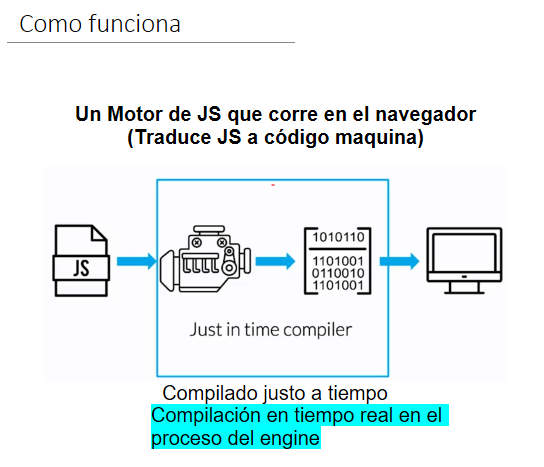
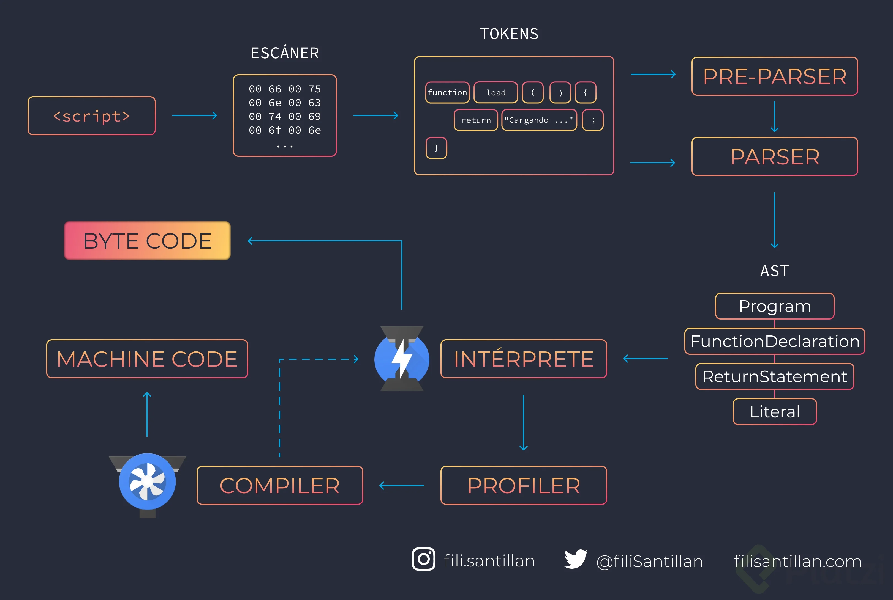
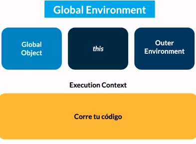
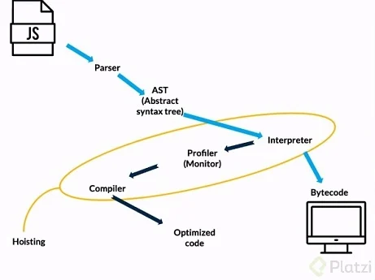
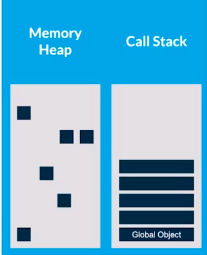
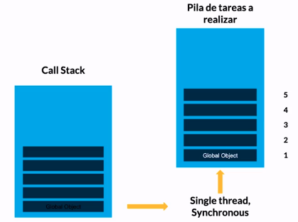
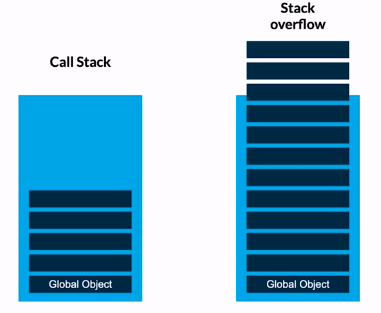
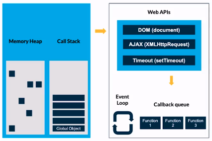

# Curso de JavaScript Engine (V8) y el Navegador

[https://platzi.com/cursos/javascript-navegador/](https://platzi.com/cursos/javascript-navegador/)
Prof: Diego De Granda

## Historia de JavaScript

**_Cinco preguntas de examen en cuatro lineas:_**

JavaScript es un lenguaje de programación que se utiliza principalmente para ✅ crear páginas web dinámicas; Fue desarrollado originalmente por ✅ Brendan Eich de ✅Netscape con el nombre de ✅Mocha, el cual fue renombrado posteriormente a LiveScript, para finalmente quedar como ✅JavaScript en el año 1995.

**RESUMEN**

Existe una pagina llamada “Evolución de la web”. En esta pagina podremos ver en una linea del tiempo una pequeña historia sobre la evolución que a tenido la web en cuanto a la creación de herramientas.

En el momento que nace la web, todas las paginas eran estáticas y era muy difícil encontrar algunas paginas, ya que no existía algún buscador que te proporcionara las paginas, a todavía había que acceder de forma directa. Justamente estas paginas eran feas, ya que solo tenían texto, imágenes y muy pocos estilos. En ese momento los usuarios pedían una evolución en la web y de ahi nace JavaScript. Su creador fue Brendan Eich. Este fue el primer desarrollador en generar JS. Pero antes de esto creo el lenguaje de programación Mocha. Este lenguaje era solo para navegador de NetScape, este evoluciono a LiveScript y a finales del 95, nace JavaScript Nombre que fue elegido solo por marketing, ya que Java estaba haciendo mucho ruido en su momento.

Después de esto, Microsoft aplico ingeniería inversa para sacar un nuevo lenguaje de programación llamado JScript, este funcionaba con Internet Explorer.

En 1997 ECMA pone en orden las cosas para que no surgieran nuevos lenguajes especializados para navegador y ellos mismos hicieron los estándares. ECMAScript Es una especificación estandarizada por ECMA. Fue creado para estandarizar JS y para ayudar a fomentar multiples implementaciones independientes.

En el 2008 se crea V8 que es un Engine. En 2009 por base a V8 se crea Node.JS

En 2010 se empezaron a crear los Frameworks para este lenguaje y en 2015 se creo el ES6 que es ECMA6 que son actualizaciones del lenguaje.

---

- **NetScape :** Fue el segundo navegador de internet, en este punto era muy difícil poder encontrar las paginas web porque no habia un buscador que indexara, al igual las paginas era muy estáticas y casi sin nada de estilo y es ahi donde [NetScape](https://es.wikipedia.org/wiki/Netscape_Communications_Corporation) estaba viendo que los usuarios estaban pidiendo una evolución en la web y es por eso que nace JavaScript.

El fundador de JavaScript es Brendan Eich pero antes de ser bautizado como JS el primer lenguaje que desarrollo fue :{

1. **Mocha** (1995) = se desarrollo aproximadamente entre 2-3 semanas este lenguaje intentaba darle un poco de interacción a las paginas
2. **LiveScript** (1995) = dado a que mocha fue desarrollado muy rápido tuvo que evolucionar a LiveScript en el mismo año para esta evolución había mas interacción en las paginas.
3. **JavaScript** (1995) ❤️ = A finales del año es que nace JS su nombre fue mas comercial ya que Java se estaba convirtiendo en un lenguaje popular entonces solo lo acompañaron con Script por ello es JavaScript.}

- **EMAC (1997)** = Vino a poner Orden a los lenguajes que iban saliendo (era muy peligroso tener muchos estándares de programación trabajando en el navegador) y es por ello donde decidieron bautizar a JavaScript como lenguaje que corre en el Navegador.
- **V8 (2008)** = Engine de JS que corre en el navegador
- **EMACScript** = Es una especificación estandarizada por ECMA Internacional, Fue creada para estandarizar JS y par ayudar a fomentar múltiples implementaciones independientes.
- **Node.js (2009)**: js en backend
- **Frameworks (2010)**:
- **ES6(2015)**

ES = ECMAScript

ES6 = ECMAScript 2015

**EMACScript →** Es una especificación estandarizada por Ecma Intenational. Fue creado para estadarizar javascript y para ayudar a fomentar múltiples implementaciones independientes.

## ¿Cómo funciona el JavaScript Engine?

JavaScript Engine: Es el motor de JS, siempre corre en el navegador. Su función es interpretar el código JavaScript y convertirlo a Machine Code para que la máquina pueda entenderlo.

- Just in time compiler: Es la compilación en tiempo real que sucede en el proceso del Engine.



## V8, el JavaScript Engine de Chrome

**_Tres preguntas de exámen_**

El motor de JavaScript V8 es lanzado en el 2008, a travás del navegador de Google Crhome, pero especialmente nació para que la aplicación Google Maps corriera mas rápido.

V8 ayuda a que JS corra de manera más rápida, con esto podemos crear aplicaciones más robustas y rápidas

**¿Qué es V8?** V8 es un motor open source escrito en C++ para compilar JavaScript y WebAssembly en código máquina. Esto quiere decir que traduce JavasScript a un código puramente digital capaz de ser interpretado por la CPU donde se ejecuta.

Este motor fue desarrollado por Google para Google Chrome y su primera versión vio la luz en 2008 junto con la primera versión del navegador.

El motor de JavaScript va a funcionar como un interprete en el navegador, para que cuando le llegue código JavaScript sea capaz de leer ese código, interpretarlo, y traducírselo a nuestra computadora para que realice la función que programamos.

Este proceso se lo conoce como **just in time compiler**. Es una técnica para mejorar el rendimiento de sistemas de programación que compilan a bytecode, consistente en traducir el bytecode a código máquina nativo en tiempo de ejecución.

**V8 Engine** es el motor de JavaScript de Chrome, utilizado también en Node. Es el que mas se esta utilizando hoy en día por su velocidad, estabilidad y evolución. Antes cada navegador tenia su propio motor, pero como V8 es muy bueno, los navegadores lo están empezando a optar.

## Profundizando en el Engine

**_Dos preguntas de examen:_**

Cuando hablamos de Windows, nos referimos a un objeto global, tambien se crea una variable llamada This, que hace referencia al objeto global de windows.

Si, this global se refiere al objeto Windows donde se está ejecutando tu código js. Esto suele confundir bastante, pero puedes verlo de esta manera:

Todo tu programa en js depende de una instancia de la clase windows en tu browser, en las clases identificas las variables de instancia con this (en Python se usa self) esto ayuda a diferenciar las clases de los objetos (instancias que crees de la clase). Te recomiendo ver el curso de programación orientada a objetos para que entiendas por donde van los hilos.





- Una vez el motor recibe un archivo JS genera un Global enviroment
- En el Global enviroment se genera un Global object que es igual a window
- También se genera una variable this. This depende del contexto, en el entorno global this es igual al objeto global
- Ya después de generado el entorno global, comienza a correr nuestro código en el contexto de ejecución, a través de un stack de tareas apiladas
- Una vez que el motor comienza a interactuar con el navegador, genera un parseo del documento completo, para encontrar las keywords y las pasa al AST (abstract syntax tree) [AST Explorer](https://astexplorer.net/)



- Una vez se tiene el AST, el motor lo pasa al interpreter para retornar bytecode puede ser entendido por la máquina
- Si en la interpretación del AST ve mucho código que se repite y que se puede optimizar entra el profiler o monitor, y optimiza el codigo y lo regresa compilado como bytecode para que la máquina lo pueda comprender. Es justo en este paso donde aparece el hoisting, donde el motor en su función de optimizacion reinterpreta el código de una mejor forma y se pueden presentar errores de programacón.
- El hoisting solo sucede con variables y funciones que se mandan a llamar.

## Ejemplo de Objeto global y hoisting

**Hoisting**

- Si llamamos una variable antes de ser declarada, el compiler crea la variable en la memory heap y la inicializa como undefined
- En el caso de las funciones es distinto, primero mandamos a llamar a las funciones antes de ejecutarlas.
- El hoisting a veces funciona pero no tenemos control de las variables que se van a cambiar
- Si llamamos a una constante (const) antes de inicializar retorna un error de tipo: Uncaught ReferenceError, que corresponde a variables que son referenciadas pero no pudieron ser capturadas

El Hoisting no aplica a **let** y **const**.Por eso es recomendado no usar **var**. Tampoco a la funciones expresivas: **const myFunc = function() {}**

Como tal, Javascript **no** eleva las declaraciones de function y de var, lo que hace es que en el momento de parsearlo, se buscan las palabras claves y se le asignan un valor, un estado inicial en los siguientes casos es:

- var: le asigna undefined.
- let y const: le colocá **No asignado.**
- para las function declaration si les asigna su contenido propio.

El hecho de “elevar” es una forma de simplificar la explicación, pero es importante reconocer que es lo que sucede realmente para nuestra formación profesional

## Memory Heap

Single thread (synchronous)→ Js ejecuta una sentencia a la vez.

Los objetos en JS (objetos, arrays, funciones y básicamente todo lo que no sea un valor primitivo) se almacenan en la parte de memoria que de llama Memory Heap.

Los valores primitivos son almacenados en el Call Stack, dentro del Scope (Contexto de Ejecución de la función que tenga acceso a esa variable). Acceder al Call Stack es mucho más rápido que al Heap. Además, en el Call Stack también se guardan las referencias, “como si fueran valores primitivos”.

Cuando se asigna una variable a otra y esta apunta a un objeto, se copia la referencia, como si fuera un valor primitivo. Si el objeto tiene atributos como un número por ejemplo, este se guarda en la posición de memoria reservada para ese objeto.

Los objetos también pueden tener más objetos dentro. En ese caso, dentro de la posición de memoria de ese objeto se va a guardar una referencia a otra posición de memoria

La forma en que funciona el Memory Heap se llama almacenamiento por nodos, al momento de almacenar la variable/objeto lo encapsula y le asigna un **id**  y un **id padre** , esto se conoce como **nodos** , lo que le permite al motor saber cuales son las variables y su contenido enlazado en caso que sea un objeto. Así el motor administra la memoria y este “estante” es limpiado una vez termina la ejecución del JS

El memory heap se guarda en la RAM, y esta es una memoria volátil (Es decir, no puede preservar la información una vez el computador se apaga)

Por lo que, si se cierra el navegador o se apaga el computador, lo que haya estado en el memory heap se pierde.



Las variables y funciones se almacenan en Memory Heap y llaman desde el Call Stack.

## Call Stack

Las tareas se ejecutan desde la pila (call stack), se apilan desde abajo hacia arriba. Una tarea que manda a llamar a otra, lo que hace es colocarla más arriba en la pila. A esto se le llama sincronía. Solo se ejecuta una tarea a la vez.



En chrome: Source / Snippets

- En la parte derecha vemos el call stack, el scope, breakpoints

```jsx
function restaDos(num) {
  return num - 2;
}
function calcular() {
  const sumarTotal = 4 + 5;
  return restaDos(sumarTotal);
}
debugger;
calcular();
```

**Callstack**

- Como se mandan a llamar las variables y las funciones
- Las tareas en el callstack se apilan de abajo hacia arriba.
- Se llaman de la última que mandamos a llamar hacia abajo
- En la base de la pila reposa el Global Object
- Si una función llama a otra, la pone encima de la pila.
- Se ejecuta una tarea a la vez (sincronía)
- Una vez que se van ejecutando las tareas se van retirando de la pila
- Al ejecutar todas las tareas se retira el Global object.

## Garbage Collection

**Garbage collecction**

es el proceso de rastrear los “desechos” y limpiar la memoria(Mark and Sweep) para evitar un overstack.

**Mark and sweep**

es el proceso en el que marca(mark) los espacios de memoria no utilizados en el heap y los elimina(sweep).

## Stack overflow

El **stack overflow**  se genera cuando el **call stack**  se llena completamente (**_pila de tareas_**) .Esto pasa cuando se genera o se trabaja con **bucles infinitos, recurcividad y funciones**. Entonces este entra en stack overflow , tenemos que tener cuidado de ocacionar estos stack!!!



Modificaron el motor para que detecte cuando se va a producir un stack overflow y frena la ejecución del programa. Si no, el navegador crashería, colgándose o cerrándose.

## JavaScript Runtime

### JS runtime

JavaScript es síncrono, va haciendo una tarea a la vez.

- Primero tenemos nuestro código en el **_memory heap_**, tenemos referencias
- Cuando vamos a ejecutar alguna parte de nuestro código va al **_call stack_**
- En el call stack se va apilando las tareas que tiene que hacer, cuando resuelve la tarea la saca del call stack
- Si hay código asíncrono se va a la parte de **_Web API´s_**, son API´s que nos proporciona el navegador para poder hacer interacciones dentro de nuestra aplicación (DOM, XMLHttpRequest, eventos)
- Cuando las API´s son requeridas pasan al **_callback queue_**, usan el modelo FIFO (First In First Out)
- Cuando termina de ejecutarse la parte síncrona, la parte asíncrona que esta en el callback queue pasa al **_call stack_**



APIS: [https://developer.mozilla.org/en-US/docs/Web/API](https://developer.mozilla.org/en-US/docs/Web/API)

## Asincronía

**Asincronismo**: Cuando hablamos del asincronismo hablamos del siguiente proceso →

- En el JS runtime enviroment se comienza a ejecutar nuestro codigo haciendo uso del Memory Heap y el Call Stack.Pero haciendo uso del Timer una de nuastras Web API’s (API’s del V8 de chrome). Podemos “delegar” codigo que el browser va a ir preparando simultaneamente pero sin ejecutarse todavia. Los resultados de este codigo solo entraran en escena cuando sea autorizado por el Event Loop.
- El codigo delegado debe ser guardado bajo el method setTimeout(), este lo pasara por la API Timer. Que organizara el codigo en un Callback Queue
- El orden en que se van a ejecutar estas acciones se ubica en el Callback Queue.
- Este codigo “delegado”, listo para ejectutarse segun el Callback Queue solo se ejecutara cuando las tareas en el Call Stack esten hechas.
- El event loop se encarga de verificar iterativamente si el Call Stack esta vacio, para luego permitir la ejecucion de las acciones en el Callback Queue

pd: No me quedo muy claro si el Timer es una API o no, asi que si tengo mal esa parte sientase libre de corregirme.

---

**Conceptos**

**Memory Heap:** Espacio en donde se guardan las funciones y las variables

**Call Stack:** Espacio en donde se estarán apilando todas las tareas de las cosas que debemos hacer en JS para darle interacción al navegador

**Web API:** Puede ofrecer APIs propias del navegador

- Que ayuden a manipular el dom
- Que ayuda a manipular el tiempo de respuesta de algunas funciones
- Que no ayudan a generar peticiones

_Funciones que el navegador ofrece: [https://developer.mozilla.org/en-US/docs/Web/API](https://developer.mozilla.org/en-US/docs/Web/API)_

**Callback Queue:** Bandeja de espera (espera a que el Call Stack este vacío).

**Event Loop**: Observador

**Funcionamiento:** JavaScript delega las tareas pertenecientes del navegador al navegar para continuar ejecutando las funciones que le son propias. En paralelo el navegador comienza a trabajar con esa función y al terminar la colocara en el Callback Queue.

Luego el Event Loop lo que hace es preguntar al Call Stack si termino con sus tareas y esta vació. En caso de que el Call Stack este ocupado con una tarea le dice “no”. En caso de haber terminado con sus tareas, el Event Loop mueve el Fn1 del Callback Queue al Call Stack.
