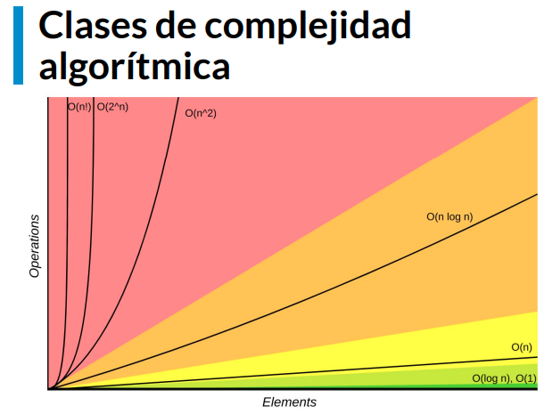
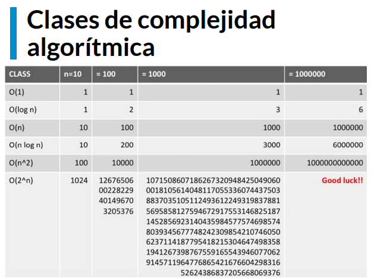
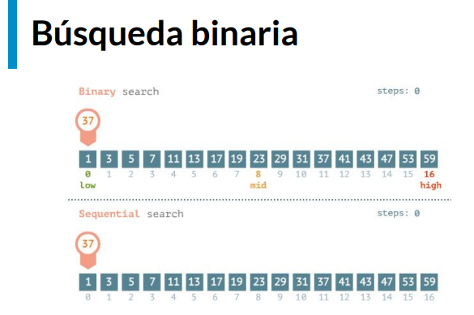
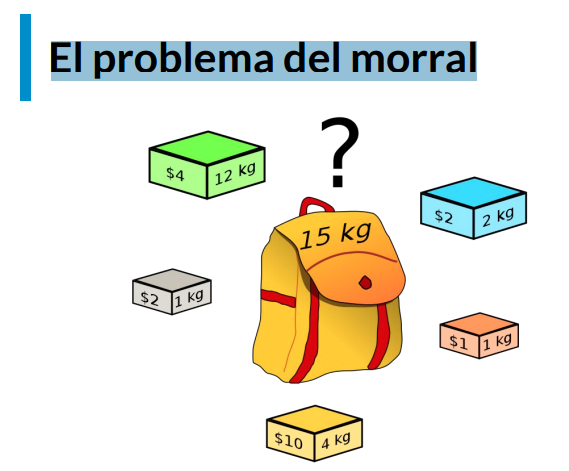

# Curso de POO y Algoritmos con Python

https://platzi.com/cursos/poo-python/
prof: David Aroesti

## Lo que aprenderás sobre programación orientada a objetos y algoritmos con Python

<u>Objetivos</u>

- Entender cómo funciona la Programación Orientada a Objetos
- Entender cómo medir la eficiencia temporal y espacial de nuestros algoritmos.
- Entender cómo y por qué graficar
- Aprender a resolver problemas de búsqueda, ordenación y optimización

## Programación Orientada a Objetos

Uno de los elementos más importantes de los lenguajes de programación es la utilización de clases para organizar programas en módulos y abstracciones de datos.

Las clases se pueden utilizar de diversas maneras. Pero en este artículo hablaremos de cómo utilizarlas en el contexto de la programación orientada a objetos. La clave para entender la programación orientada a objetos es pensar en objetos como agrupaciones de datos y los métodos que operan en dichos datos.

Por ejemplo, podemos representar a una persona con propiedades como nombre, edad, género, etc. y los comportamientos de dicha persona como caminar, cantar, comer, etc. De la misma manera podemos representar unos audífonos con propiedades como su marca, tamaño, color, etc. y sus comportamientos como reproducir música, pausar y avanzar a la siguiente canción.

Puesto de otra manera, la programación orientada a objetos nos permite modelar cosas reales y concretas del mundo y sus relaciones con otros objetos.

Las ideas detrás de la programación orientada a objetos tienen más de 50 años y han sido ampliamente aceptadas y practicadas en los últimos treinta. A mediados de la década de los setenta se comenzaron a escribir artículos académicos explicando los beneficios de esta aproximación a la programación. También durante esos años se comenzaron a escribir los primeros lenguajes de programación que incorporaban estas ideas (como Smalltalk y CLU). Pero no fue hasta la llegada de Java y C++ que la idea consiguió un número importante de seguidores.

Hasta ahora, en el curso previo de esta serie hemos utilizado programación orientada a objetos de manera implícita. Cuando decimos “Los objetos son las principales cosas que un programa de Python manipula. Cada objeto tiene un tipo que define qué cosas puede realizar un programa con dicho objeto,” nos estamos refiriendo a las ideas principales de la programación orientada a objetos. Hemos utilizado los tipos lista y
diccionario, entre muchos otros, así como los métodos asociados a dichos tipos.

Así como los creadores de un lenguaje de programación solo pueden diseñar una fracción muy pequeña de todas las funciones útiles (como abs, float, type, etc.), también pueden escribir una fracción muy pequeña de los tipos útiles (int, str, dict, list, etc.). Ya sabemos los mecanismos que nos permiten crear funciones, ahora veremos los mecanismos que nos permiten crear nuevos tipos (o clases).

**Clases en Python**

Las estructuras primitivas con las que hemos trabajado hasta ahora nos permiten definir cosas sencillas, como el costo de algo, el nombre de un usuario, las veces que debe correr un bucle, etc. Sin embargo, existen ocasiones cuando necesitamos definir estructuras más complejas, por ejemplo un hotel. Podríamos utilizar dos listas: una para definir los cuartos y una segunda para definir si el cuarto se encuentra ocupado o no.

```python
cuartos_de_hotel = [101, 102, 103, 201, 202, 203]
cuarto_ocupado = [True, False, False, True, True, False]
```

Sin embargo, este tipo de organización rápidamente se sale de control. ¿Qué tal que quisiéramos añadir más propiedades, cómo si el cuarto ya fue aseado o no? ¿Si el cuarto tiene cama doble o sencilla? Esto nos lleva a una falta fuerte de organización y es justamente el punto que justifica la existencia de clases.

Las clases nos permiten crear nuevos tipos que contiene información arbitraria sobre un objeto. En el caso del hotel, podríamos crear dos clases Hotel() y Cuarto() que nos permitiera dar seguimiento a las propiedades como número de cuartos, ocupación, aseo, tipo de habitación, etc.

Es importante resaltar que las clases solo proveen estructura. Son un molde con el cual podemos construir objetos específicos. La clase señala las propiedades que los hoteles que modelemos tendrán, pero no es ningún hotel específico. Para eso necesitamos las instancias.

**Instancias**

Mientras que las clases proveen la estructura, las instancias son los objetos reales que creamos en nuestro programa: un hotel llamado PlatziHotel o Hilton. Otra forma de pensarlo es que las clases son como un formulario y una vez que se llena cada copia del formulario tenemos las instancias que pertenecen a dicha clase. Cada copia puede tener datos distintos, al igual que cada instancia es distinta de las demás (aunque todas pertenecen a una misma clase).

Para definir una clase, simplemente utilizamos el keyword class. Por ejemplo:

```python
class Hotel:
    pass
```

Una vez que tenemos una clase llamada Hotel podemos generar una instancia llamando al constructor de la clase.

```python
hotel = Hotel()
```

**Atributos de la instancia**

Todas las clases crean objetos y todos los objetos tienen atributos. Utilizamos el método especial **init** para definir el estado inicial de nuestra instancia. Recibe como primer parámetro obligatorio self (que es simplemente una referencia a la instancia).

```python
class Hotel:

    def __init__(self, numero_maximo_de_huespedes, lugares_de_estacionamiento):
        self.numero_maximo_de_huespedes = numero_maximo_de_huespedes
        self.lugares_de_estacionamiento = lugares_de_estacionamiento
        self.huespedes = 0

hotel = Hotel(numero_maximo_de_huespedes=50, lugares_de_estacionamiento=20)
print(hotel.lugares_de_estacionamiento) # 20
```

**Métodos de instancia**

Mientras que los atributos de la instancia describen lo que representa el objeto, los métodos de instancia nos indican qué podemos hacer con las instancias de dicha clase y normalmente operan en los mencionados atributos. Los métodos son equivalentes a funciones dentro de la definición de la clase, pero todos reciben self como primer argumento.

```python
class Hotel:

    ...

    def anadir_huespedes(self, cantidad_de_huespedes):
        self.huespedes += cantidad_de_huespedes

    def checkout(self, cantidad_de_huespedes):
        self.huespedes -= cantidad_de_huespedes

    def ocupacion_total(self):
        return self.huespedes


hotel = Hotel(50, 20)
hotel.anadir_huespedes(3)
hotel.checkout(1)
hotel.ocupacion_total() # 2
```

Ahora que ya sabemos qué son las clases y cómo las podemos utilizar en nuestros programas, platícanos qué clases te serían útiles para modelar en uno de tus programas.

## Tipos de datos abstractos, clases e instancias

<u>Tipos de datos abstractos</u>

- En Python todo es un objeto y tiene un tipo.
  - Representación de datos y formas deinteractuar con ellos.
- Formas de interactuar con un objeto:
  - Creación
  - Manipulación
  - Destrucción

<u>Ventajas</u>:

- Decomposición
- Abstracción
- Encapsulación

```python
# definición de clase
class <nombre_de_la_clase>(<super_clase>):
 def __init__(self, <params>):
 <expresion>
 def <nombre_del_metodo>(self, <params>):
 <expresion>
```

```python
 # Definición
class Persona:
    def __init__(self, nombre, edad):
        self.nombre = nombre
        self.edad = edad

    def saluda(self, otra_persona):
        return f'Hola {otra_persona.nombre, me llamo {self.nombre}.'

# Uso
>>> david = Persona('David', 35)
>>> erika = Persona('Erika', 32)
>>> david.saluda(erika)
'Hola Erika, me llamo David'
```

<u>Instancias</u>

- Mientras que la clase es un molde, a los objetos creados se les conoce como instancias.
- Cuando se crea una instancia, se ejecuta el método **init**
- Todos los métodos de una clase reciben implícitamente como primer parámetro self
- Los atributos de clase nos permiten:
  - Representar datos
  - Procedimientos para interactuar con los mismos (métodos)
  - Mecanismos para esconder la representación interna
- Se accede a los atributos con la notación de punto
- Puede tener atributos privados. Por convención comienzan con \_

```python
# La clase es como un molde para crear objetos
class Coordenada: # La palabra empieza con  mayuscula para distinguir la clases

    def __init__(self, x, y):
        self.x = x
        self.y = y

    def distancia(self, otra_coordenada):
      x_diff = (self.x - otra_coordenada.x)**2
      y_diff = (self.y - otra_coordenada.y)**2

      return (x_diff + y_diff)**0.5

if __name__== '__main__':
    coord_1 = Coordenada(3, 30)
    coord_2 = Coordenada(4, 8)

    print(coord_1.distancia(coord_2))
    print(isinstance(coord_1, Coordenada)) # Permite determinar si alguna de estas coordenadas es instancia de coordenada

22.02271554554524
True
```

## Decomposición

<u>Decomposición</u>

- Partir un problema en problemas más pequeños
- Las clases permiten crear mayores abstracciones en forma de componentes
- Cada clase se encarga de una parte del problema y el programa se vuelve más fácil de mantener

```python
class Automovil:

    def __init__(self, modelo, marca, color):
        self.modelo = modelo
        self.marca = marca
        self.color = color
        self._estado = 'en_reposo'
        self._motor = Motor(cilindros=4)

    def acelerar(self, tipo='despacio'):
        if tipo == 'rapida':
            self._motor.inyecta_gasolina(10)
        else:
            self._motor.inyecta_gasolina(3)

        self._estado = 'en_movimiento'


class Motor:

    def __init__(self, cilindros, tipo='gasolina'):
        self.cilindros = cilindros
        self.tipo = tipo
        self._temperatura = 0

    def inyecta_gasolina(self, cantidad):
        pass
```

## Abstracción

<u>Abstracción</u>

- Enfocarnos en la información relevante
- Separar la información central de los detalles secundarios
- Podemos utilizar variables y métodos (privados o públicos)

```python
class Lavadora:

    def __init__(self):
        pass

    def lavar(self, temperatura='caliente'):
        self._llenar_tanque_de_agua(temperatura)
        self._anadir_jabon()
        self._lavar()
        self._centrifugar()

    def _llenar_tanque_de_agua(self, temperatura):
        print(f'Llenando el tanque con agua {temperatura}')

    def _anadir_jabon(self):
        print('Anadiendo jabon')

    def _lavar(self):
        print('Lavando la ropa')

    def _centrifugar(self):
        print('Centrifugando la ropa')


if __name__ == '__main__':
    lavadora = Lavadora()
    lavadora.lavar()
```

## Funciones: base de los decoradores

El concepto de <font color="green">decorador</font> en Python es algo que podríamos ubicar en un nivel “intermedio” en el manejo del lenguaje, por lo que es buena idea que tengas una base sólida, sobre todo en cuanto a funciones al momento de profundizar e implementarlas.

Los decoradores son una forma sencilla de llamar funciones de orden mayor, es decir, funciones que toman otra función como parámetro y/o retornan otra función como resultado. De esta forma un decorador añade capacidades a una función sin modificarla.

Un ejemplo de esto son las llantas de un automóvil. Si les colocas cadenas para la nieve, el automóvil aún puede andar y además extiende su funcionalidad para conducirse en otros terrenos.

<u>Recordando sobre funciones</u>

Antes de abordar el tema de decoradores haremos un pequeño repaso por las funciones, las cuales retornan un valor ante la entrada de un argumento.

Analicemos este sencillo ejemplo donde una función que multiplica un número se eleva a la tercera potencia:

```python
def elevar_cubo(numero):
	return numero * numero * numero
```

Si damos como argumento el número 3, entonces tendremos como salida el número 27 al ejecutar la función:

```python
>>> elevar_cubo(3)
27
```

<u>Funciones como objetos de primera-clase</u>

Otro concepto importante a tener en cuenta es que en Python las funciones son objetos de primera-clase, es decir, que pueden ser pasados y utilizados como argumentos al igual que cualquier otro objeto (strings, enteros, flotantes, listas, etc.).

Veamos un ejemplo donde definimos 3 diferentes funciones que utilizaremos de manera conjunta:

```python
def presentarse(nombre):
	return f"Me llamo {nombre}"

def estudiemos_juntos(nombre):
	return f"¡Hey {nombre}, aprendamos Python!"

def consume_funciones(funcion_entrante):
	return funcion_entrante("David")
```

Las primeras dos funciones son obvias en su resultado, donde nos mostrarán un mensaje con el valor de la variable nombre. La tercera función puede ser más compleja de predecir, ya que toma otra función como entrada. Veamos que pasa cuando colocamos una función como atributo:

```python
>>> consume_funciones(presentarse)
'Me llamo David'

>>> consume_funciones(estudiemos_juntos)
'¡Hey David, aprendamos Python!'
```

Pongamos atención en cómo la función consume_funciones() se escribe con paréntesis para ser ejecutada, mientras que la función presentarse y estudiemos_juntos solo hace referencia a estas.

<u>Funciones anidadas</u>

Al igual que los condicionales y bucles también puedes colocar funciones dentro de otra función.

Tómate un minuto para analizar el siguiente código e inferir cuál será el resultado de salida:

```python
def funcion_mayor():
	print("Esta es una función mayor y su mensaje de salida.")

	def librerias():
		print("Algunas librerías de Python son: Scikit-learn, NumPy y TensorFlow.")

	def frameworks():
		print("Algunos frameworks de Python son: Django, Dash y Flask.")

	frameworks()
	librerias()
```

Si llamamos a la función funcion_mayor tendremos la siguiente salida:

```python
>>> funcion_mayor()
>>> Esta es una función mayor y su mensaje de salida.
>>> Algunos frameworks de Python son: Django, Dash y Flask.
>>> Algunas librerías de Python son: Scikit-learn, NumPy y TensorFlow.
```

Debemos considerar que las funciones anidadas dentro de funcion_mayor no se ejecutan hasta que se llama a esta primera, siendo muestra del scope o alcance de las funciones. Si las llamamos obtendremos un error

---

En la siguiente lectura entraremos al concepto de decoradores, setters y getters, pues al entender mejor las funciones será más fácil asimilar su uso en la implementación del encapsulamiento.

## Setters, getters y decorador property

En este punto estamos comenzando a utilizar conceptos en Python que comienzan a ser más avanzados, por lo que es normal que puedan parecerte complejos o difíciles de asimilar, así que te animo a que los repases un par de veces.

Puedes tener la tranquilidad de que si bien, al inicio no los implementas en su totalidad, podrás seguir avanzando en el curso y poco a poco incorporarlos a tus proyectos donde lo más importante es que sepas que cuentas con estas herramientas.

<u>Entendiendo el concepto de decorador</u>

Antes de comenzar me gustaría que analices el siguiente código:

```python
def funcion_decoradora(funcion):
	def wrapper():
		print("Este es el último mensaje...")
		funcion()
		print("Este es el primer mensaje ;)")
	return wrapper

def zumbido():
	print("Buzzzzzz")

zumbido = funcion_decoradora(zumbido)
```

¿Qué pasará si llamamos a la función zumbido()? si logras determinar el resultado de salida o entenderlo con detalle, entonces podemos seguir adelante.

Lo que sucede es lo siguiente:

```python
>>> zumbido()
>>> Este es el último mensaje...
>>> Buzzzzzz
>>> Este es el primer mensaje ;)
```

Si no diste con el resultado no te preocupes, solo hay que analizarlo con detalle y el truco está en la línea zumbido = funcion_decoradora(zumbido). Sucede que la función wrapper() recibió la la función zumbido() cómo parámetro y coloca su salida entre los otros dos prints.

Todo lo que sucede se conoce en programación como metaprogramación (metaprogramming), ya que una parte del programa trata de modificar a otra durante el tiempo de compilación. En tanto un decorador básicamente toma una función, le añade alguna funcionalidad y la retorna.

<u>Mejorando la sintaxis</u>

Definitivamente la forma en que decoramos la función es complejo, pero afortunadamente Python lo tiene en cuenta y podemos utilizar decoradores con el símbolo @. Volviendo al mismo ejemplo de funcion_decoradora(), podemos simplificarlo así:

```python
@funcion_decoradora
def zumbido():
	print("Buzzzzzz")
```

En solo tres líneas de código tenemos el mismo resultado que escribir zumbido = funcion_decoradora(zumbido).

<u>¿Qué son getters y setters?</u>

A diferencia de otros lenguajes de programación, en Python los getters y setters tienen el objetivo de asegurar el encapsulamiento de datos. Cómo habrás visto, si declaramos una variable privada en Python al colocar un guión bajo al inicio de esta (\_) y normalmente son utilizados para: añadir lógica de validación al momento de obtener y definir un valor y, para evitar el acceso directo al campo de una clase.

La realidad es que en Python no existen variables netamente privadas, pues aunque se declaren con un guión bajo podemos seguir accediendo a estas. En Programación Orientada a Objetos esto es peligroso, pues podemos alterar el método de alguna clase y tener efectos colaterales que afecten la lógica de nuestra aplicación.

<u>Clases sin getters y setters</u>

Veamos un ejemplo con una clase que almacena un dato de distancia recorrida en millas (mi) y lo convierte a kilómetros (km):

```python
class Millas:
	def __init__(self, distancia = 0):
		self.distancia = distancia

	def convertir_a_kilometros(self):
		return (self.distancia * 1.609344)
```

Ahora creemos un objeto que haga referencia a un viaje:

```python
# Creamos un nuevo objeto
avion = Millas()

# Indicamos la distancia
avion.distancia = 200

# Obtenemos el atributo distancia
>>> print(avion.distancia)
200

# Obtenemos el método convertir_a_kilometros
>>> print(avion.convertir_a_kilometros())
321.8688
```

<u>Utilizando getters y setters</u>

Incluyamos un par de métodos para obtener la distancia y otro para que no acepte valores inferiores a cero, pues no tendría sentido que un vehículo recorra una distancia negativa. Estos son métodos getters y setters:

```python
class Millas:
	def __init__(self, distancia = 0):
		self.distancia = distancia

	def convertir_a_kilometros(self):
		return (self.distancia * 1.609344)

	# Método getter
	def obtener_distancia(self):
		return self._distancia

	# Método setter
	def definir_distancia(self, valor):
		if valor < 0:
			raise ValueError("No es posible convertir distancias menores a 0.")
		self._distancia = valor
```

El método getter obtendrá el valor de la distancia que y el método setter se encargará de añadir una restricción. También debemos notar cómo distancia fue reemplazado por \_distancia, denotando que es una variable privada.

Si probamos nuestro código funcionará, la desventaja es que cualquier aplicación que hayamos creado con una base similar deberá ser actualizado. Esto no es nada escalable si tenemos cientos o miles de líneas de código.

<u>Función property()</u>

Esta función está incluida en Python, en particular crea y retorna la propiedad de un objeto. La propiedad de un objeto posee los métodos getter(), setter() y del().

En tanto la función tiene cuatro atributos: property(fget, fset, fdel, fdoc) :

- fget : trae el valor de un atributo.
- fset : define el valor de un atributo.
- fdel : elimina el valor de un atributo.
- fdoc : crea un docstring por atributo.

Veamos un ejemplo del mismo caso implementando la función property() :

```python
class Millas:
	def __init__(self):
		self._distancia = 0

	# Función para obtener el valor de _distancia
	def obtener_distancia(self):
		print("Llamada al método getter")
		return self._distancia

	# Función para definir el valor de _distancia
	def definir_distancia(self, recorrido):
		print("Llamada al método setter")
		self._distancia = recorrido

	# Función para eliminar el atributo _distancia
	def eliminar_distancia(self):
		del self._distancia

	distancia = property(obtener_distancia, definir_distancia, eliminar_distancia)

# Creamos un nuevo objeto
avion = Millas()

# Indicamos la distancia
avion.distancia = 200

# Obtenemos su atributo distancia
>>> print(avion.distancia)
Llamada al método getter
Llamada al método setter
200
```

Aunque en este ejemplo hay una sola llamada a print, tenemos tres líneas como salida pues esta llama a los primeros dos métodos. Por lo que la propiedad distancia es una propiedad de objeto que ayuda a mantener el acceso de forma privada.

<u>Decorador @property</u>

Este decorador es uno de varios con los que ya cuenta Python, el cual nos permite utilizar getters y setters para hacer más fácil la implementación de la programación orientada a objetos en Python cambiando los métodos o atributos de las clases de forma que no modifiquemos el código.

Pero mejor veamos un ejemplo en acción:

```python
class Millas:
	def __init__(self):
		self._distancia = 0

	# Función para obtener el valor de _distancia
	# Usando el decorador property
	@property
	def obtener_distancia(self):
		print("Llamada al método getter")
		return self._distancia

	# Función para definir el valor de _distancia
	@obtener_distancia.setter
	def definir_distancia(self, valor):
		if valor < 0:
			raise ValueError("No es posible convertir distancias menores a 0.")
		print("Llamada al método setter")
		self._distancia = valor

# Creamos un nuevo objeto
avion = Millas()

# Indicamos la distancia
avion.distancia = 200

# Obtenemos su atributo distancia
>>> print(avion.definir..distancia)
Llamada al método getter
Llamada al método setter
200
```

De esta manera usamos el decorador @property para utilizar getters y setters de una forma más prolija e incluimos una nueva funcionalidad a nuestro método definir_distancia() , al mismo tiempo protegemos el acceso a nuestras variables privadas y cumplimos con el principio de encapsulación.

## Encapsulación, getters and setters

<u>Encapsulación</u>

- Permite agrupar datos y su comportamiento
- Controla el acceso a dichos datos
- Previene modificaciones no autorizadas

```python
class CasillaDeVotacion:
    def __init__(self, identificador, pais)
        self._identificador = identificador
        self._pais = pais
        self._region = None

    @property
    def region(self):
        return self._region

    @region.setter
    def set_region(self, region):
        if region in self._pais:
            self._region = region
            raise ValueError(f'La region {region} no es valida en {self._pais}')

>>> casilla = CasillaDeVotacion(123, ['Ciudad de Mexico', ‘Morelos’])
>>> casilla.region
None
>>> casilla.region = 'Ciudad de Mexico'
>>> casilla.region
'Ciudad de México'
```

## Herencia

<u>Herencia</u>

- Permite modelar una jerarquía de clases.
- Permite compartir comportamiento común en la jerarquía.
- Al padre se le conoce como superclase y al hijo como subclase.

```python
class Rectangulo:

    def __init__(self, base, altura):
        self.base = base
        self.altura = altura

    def area(self):
        return self.base * self.altura

class Cuadrado(Rectangulo):

    def __init__(self, lado):
        super().__init__(lado, lado)


if __name__ == '__main__':
    rectangulo = Rectangulo(base=3, altura=4)
    print(rectangulo.area())

    cuadrado = Cuadrado(lado=5)
    print(cuadrado.area())
```

La herencia es el fenómeno que se dá cuando una clase superior, le comprate sus atributos y métodos a un aclase derivada, sin ncedidad de que esta útlima clase defina todos los atributos y métodos nuevamente.

La clase derivada hereda carcterísticas de la clase base donde se pueden agregar nuevas características. Esto resulta en reutilización de código.

super() es una función que pertmite acceder a los atributos y métodos de las clase base.

En la herencia múltiple, las carcaterísticas de todas las clase base se heredan en la clase derivada.

## Polimorfismo

<u>Polimorfismo</u>

- La habilidad de tomar varias formas.
- En Python, nos permite cambiar el comportamiento de una superclase para adaptarlo a la subclase

```python
class Persona:

    def __init__(self, nombre):
        self.nombre = nombre

    def avanza(self):
        print('Ando caminando')

class Ciclista(Persona):

    def __init__(self, nombre):
        super().__init__(nombre)

    def avanza(self):
        print('Ando moviendome en mi bicicleta')

def main():
    persona = Persona('David')
    persona.avanza()

    ciclista = Ciclista('Daniel')
    ciclista.avanza()

if __name__ == '__main__':
    main()
```

## Introducción a la complejidad algorítmica

<u>Introducción a la complejidad algorítmica</u>

- ¿Por qué comparamos la eficiencia de un algoritmo?
- Complejidad temporal vs complejidad espacial
- Podemos definirla como T(n)

La complejidad algorítmica nos permite comprar la eficiencia entre dos algoritmos, y esto a su vez, nos permite predecir el tiempo que nos tardaremos en resolver un problema.

La complejidad no es solo temporal, también puede ser espacial (cuanto espacio de memoria necesitamos para resolver un problema). Nosotros nos veremos la complejidad temporal

Cómo podemos implementar la función T(n), tiempo?

<u>Aproximaciones</u>

- Cronometrar el tiempo en el que corre un algoritmo. Pero depende de muchos factores: hard, competencia de procesos.
- Contar los pasos con una medida abstracta de operación. Pero la solución puede variar de algoritmo a algoritmo.
- Contar los pasos (con una medida asintótica) conforme nos aproximamos al infinito. Esta es la solución.

```python
import time

def factorial(n):
    respuesta = 1

    while n > 1:
        respuesta *= n
        n -= 1

    return respuesta


def factorial_r(n):
    if n == 1:
        return 1

    return n * factorial_r(n - 1)


if __name__ == '__main__':
    n = 200000

    comienzo = time.time()
    factorial(n)
    final = time.time()
    print(final - comienzo)

    comienzo = time.time()
    factorial_r(n)
    final = time.time()
    print(final - comienzo)
```

Con este ejemplo vemos que no podemos predecir cómo será el tiempo de ejecución comprando la forma iterativa con la forma recursiva.

## Conteo abstracto de operación

Vamos a ver matemáticamente como crece la función.

```python
def f(x):
    respuesta = 0     # Operación 1 (asignación)
    for i in range(1000):
        respuesta += 1    # 1000 operaciones
    for i in range(x):
        respuesta += x    # x operaciones
    for i in range(x):
        for j in range(x):
            respuesta += 1
            respuesta += 1  # 2x . x = x**2
    return respuesta    # 1 operacion
```

Contamos la cantidad de operaciones para generar una ecuación: $ 1002 + x + 2x^2 $

Esta es una buena aproximación pero los términos no nos importan en cuanto el tamaño del problema se hace más y más grande.

Veremos big O Notation que descarta los términos que no nos interesan (1002, x y el 2)

## Notación asintótica

Hasta el momento comparamos utilizando contador de tiempo y luego contando la cantidad de pasos.

Nos dimos cuenta que en la función resultante hay términos que no nos interesan conforme las entrdas se van al infinito.

<u>Creciento asintótico (conforme se va al infinito)</u>: significa hacia adonde se acerca conforme el imput se va al infinito

- No importan variaciones pequeñas.
- El enfoque se centra en lo que pasa conforme el tamaño del problema se acerca al infinito.
- Mejor de los casos, promedio, peor de los casos
- Big O
- Nada más importa el término de mayor tamaño

```python
# Ley de la suma
def f(n):
    for i in range(n):
        print(i)
    for i in range(n):
        print(i)
# O(n) + O(n) = O(n + n) = O(2n) = O(n)
```

Esta función tiene un crecimiento lineal. Se dice la función crece en O de n.

```python
# Ley de la suma
def f(n):
    for i in range(n):
        print(i)

    for i in range(n * n):
    print(i)
# O(n) + O(n * n) = O(n + n²) = O(n²)
```

La primera parte cre linealmente pero la segunda crece al cuadrado. Pero en big O solo nos interesa el términ o más grande entonces decimos que crece en O de n al cuadrado. Es una función cuadrática

```python
# Ley de la multiplicación
def f(n):
    for i in range(n):
        for j in range(n):
            print(i, j)
# O(n) * O(n) = O(n * n) = O(n²)
```

Este es un crecimiento cuadrático $(nxn) = n^2$

```python
# Recursividad múltiple
def fibonacci(n):
 if n == 0 or n == 1:
 return 1
 return fibonacci(n - 1) + fibonacci(n - 2)
# O(2**n)
```

En este caso tenemos un crecimiento exponencial.

<u>Concluimos</u>:

- Un loop => crecimiento lineal.
- Un loop dentro de otro => crecimiento cuadratico
- Llamadas recursivas => crecimiento exponecncial.

## Clases de complejidad algorítmica

<u>Clases de complejidad algorítmica</u>

- O(1) Constante: no importa la cantidad de input que reciba, siempre demorara el mismo tiempo.

- O(n) Lineal: la complejidad crecerá de forma proporcional a medida que crezca el input.

- O(log n) Logarítmica: nuestra función crecerá de forma logarítmica con respecto al input. Esto significa que en un inicio crecerá rápido, pero luego se estabilizara.

- O(n log n) Log lineal: crecerá de forma logarítmica pero junto con una constante.

- O(n²) Polinomial: crecen de forma cuadrática. No son recomendables a menos que el input de datos en pequeño.

- $O(2^n)$ Exponencial: crecerá de forma exponencial, por lo que la carga es muy alta. Para nada recomendable en ningún caso, solo para análisis conceptual.

- O(n!) Factorial: crece de forma factorial, por lo que al igual que el exponencial su carga es muy alta, por lo que jamas utilizar algoritmos de este tipo.





## Búsqueda lineal

El computer scientist debe poder reducir un problema a un problema sobre el que conocemos la solución. Si tenemos 20 algoritmos y nos encontramos un problema que podemos convertir a un problema que tiene un algoeitmo eficiente que podemos utilizar, ya resolvimos el problema.

<u>Búsqueda lineal</u>

- Busca en todos los elementos de manera secuencial
- ¿Cuál es el peor caso? -> el último elemento o que no exista

```python
import random

def busqueda_lineal(lista, objetivo):
    match = False

    for elemento in lista: # O(n)
        if elemento == objetivo:
            match = True
            break

    return match


if __name__ == '__main__':
    tamano_de_lista = int(input('De que tamano sera la lista? '))
    objetivo = int(input('Que numero quieres encontrar? '))

    lista = [random.randint(0, 100) for i in range(tamano_de_lista)]

    encontrado = busqueda_lineal(lista, objetivo)
    print(lista)
    print(f'El elemento {objetivo} {"esta" if encontrado else "no esta"} en la lista')
```

Cuál es la complejidad algoritmica? O(n) porque el elemento que más importa es el loop que crece con el tamaño de una lista.

## Búsqueda binaria

<u>Búsqueda binaria</u> Este algoritmo supone que la lista está ordenada. Después veremos que no existe un buen algoritmo para poder ordenar. => Debemos ordenar para hacer búsqueda binaria o no? Depende de la cantidad de veces que tengamos que realizar búsquedas. Si son varias podemos ordenarla y realizar búsqueda binaria. Amortizamos el costo del ordenamiento. Too, en este caso compiten tiempo vs memoria(espacio). Si queremos optimizar tiempo generalmente tendremos que ocupar más memoria. En este caso tenemos que guarda la lista ordenada.

- Divide y conquista
- El problema se divide en 2 en cada iteración
- ¿Cuál es el peor caso?



```python
import random

def busqueda_binaria(lista, comienzo, final, objetivo):
    print(f'buscando {objetivo} entre {lista[comienzo]} y {lista[final - 1]}')
    if comienzo > final:
        return False

    medio = (comienzo + final) // 2   # division de enteros

    if lista[medio] == objetivo:
        return True
    elif lista[medio] < objetivo:
        return busqueda_binaria(lista, medio + 1, final, objetivo)
    else:
        return busqueda_binaria(lista, comienzo, medio - 1, objetivo)


if __name__ == '__main__':
    tamano_de_lista = int(input('De que tamano es la lista? '))
    objetivo = int(input('Que numero quieres encontrar? '))

    lista = sorted([random.randint(0, 100) for i in range(tamano_de_lista)])

    encontrado = busqueda_binaria(lista, 0, len(lista), objetivo)

    print(lista)
    print(f'El elemento {objetivo} {"esta" if encontrado else "no esta"} en la lista')
```

## Ordenamiento de burbuja

El <font color="green">ordenamiento de burbuja</font> es un algoritmo que recorre repetidamente una lista que necesita ordenarse. Compara elementos adyacentes y los intercambia si están en el orden incorrecto. Este procedimiento se repite hasta que no se requieren más intercambios, lo que indica que la lista se encuentra ordenada.

Recorreremos la lista 1 vez , por cada elemento. # O(n) _ O(n) = O(n _ n) = O(n\*\*2). Crecimiento cuádratico, no es tan bueno. Con pocos elementos no pasa nada pero si tenemos listas grandes este algoritmo no funciona.

6 5 3 1 8 7 2 4
5 3 1 6 7 2 4 8 # en la primer pasada llegamos coloca el nro más grande al final.
3 1 5 6 2 4 7 8
1 3 5 6 2 4 7 8  
1 3 5 2 4 6 7 8
1 3 2 4 5 6 7 8
1 2 3 4 5 6 7 8

```python
import random


def ordenamiento_de_burbuja(lista):
    n = len(lista)

    for i in range(n):
        for j in range(0, n - i - 1): # O(n) * O(n) = O(n * n) = O(n**2)

            if lista[j] > lista[j + 1]:
                lista[j], lista[j + 1] = lista[j + 1], lista[j]

    return lista

if __name__ == '__main__':
    tamano_de_lista = int(input('De que tamano sera la lista? '))

    lista = [random.randint(0, 100) for i in range(tamano_de_lista)]
    print(lista)

    lista_ordenada = ordenamiento_de_burbuja(lista)
    print(lista_ordenada)
```

## Ordenamiento por inserción

El <font color="green">ordenamiento por inserción</font> es uno de los algoritmos más comunes que estudian
los Científicos del Cómputo. Es intuitivo y fácil de implementar, pero es muy ineficiente para listas de gran tamaño.

Una de las características del ordenamiento por inserción es que ordena en “su lugar.” Es decir, no requiere memoria adicional para realizar el ordenamiento ya que simplemente modifican los valores en memoria.

La definición es simple:

Una lista es dividida entre una sublista ordenada y otra sublista desordenada. Al principio, la sublista ordenada contiene un solo elemento, por lo que por definición se encuentra ordenada.

A continuación se evalua el primer elemento dentro la sublista desordenada para que podamos insertarlo en el lugar correcto dentro de la lista ordenada.

La inserción se realiza al mover todos los elementos mayores al elemento que se está evaluando un lugar a la derecha.

Continua el proceso hasta que la sublista desordenada quede vacia y, por lo tanto, la lista se encontrará ordenada.

<u>Veamos un ejemplo</u>:

Imagina que tienes la siguiente lista de números:

7, 3, 2, 9, 8

Primero añadimos 7 a la sublista ordenada:

7, 3, 2, 9, 8

Ahora vemos el primer elemento de la sublista desordenada y lo guardamos en una variable para mantener el valor. A esa variable la llamaremos valor_actual. Verificamos que 3 es menor que 7, por lo que movemos 7 un lugar a la derecha.

7, 7, 2, 9, 8 (valor_actual=3)

3 es menor que 7, por lo que insertamos el valor en la primera posición.

3, 7, 2, 9, 8

Ahora vemos el número 2. 2 es menor que 7 por lo que lo movemos un espacio a la derecha y hacemos lo mismo con 3.

3, 3, 7, 9, 8 (valor_actual=2)

Ahora insertamos 2 en la primera posición.

2, 3, 7, 9, 8

9 es más grande que el valor más grande de nuestra sublista ordenada por lo que lo insertamos directamente en su posición.

2, 3, 7, 9, 8

El último valor es 8. 9 es más grande que 8 por lo que lo movemos a la derecha:

2, 3, 7, 9, 9 (valor_actual=8)

8 es más grande que 7, por lo que procedemos a insertar nuestro valor_actual.

2, 3, 7, 8, 9

Ahora la lista se encuentra ordenada y no quedan más elementos en la sublista desordenada.

Antes de ver la implementación en Python, trata de implementarlo por ti mismo y compártenos tu algoritmo en la sección de comentarios.

Esta es una forma de implementar el algoritmo anterior:

```python
def ordenamiento_por_insercion(lista):

    for indice in range(1, len(lista)):
        valor_actual = lista[indice]
        posicion_actual = indice

        while posicion_actual > 0 and lista[posicion_actual - 1] > valor_actual:
            lista[posicion_actual] = lista[posicion_actual - 1]
            posicion_actual -= 1

        lista[posicion_actual] = valor_actual
```

## Ordenamiento por mezcla

El <font color="green">ordenamiento por mezcla</font> es un algoritmo de divide y conquista. Primero divide una lista en partes iguales hasta que quedan sublistas de 1 o 0 elementos. Luego las recombina en forma ordenada.

6 5 3 1 8 7 2 4

56 13 78 24

1356 2478

12345678

Al final recorreremos la lista n veces

```python
import random

def ordenamiento_por_mezcla(lista):
    if len(lista) > 1:
        medio = len(lista) // 2
        izquierda = lista[:medio]
        derecha = lista[medio:]
        print(izquierda, '*' * 5, derecha)

        # llamada recursiva en cada mitad
        ordenamiento_por_mezcla(izquierda)
        ordenamiento_por_mezcla(derecha)

        # Iteradores para recorrer las dos sublistas
        i = 0
        j = 0
        # Iterador para la lista principal
        k = 0

        while i < len(izquierda) and j < len(derecha):
            if izquierda[i] < derecha[j]:
                lista[k] = izquierda[i]
                i += 1
            else:
                lista[k] = derecha[j]
                j += 1

            k += 1

        while i < len(izquierda):
            lista[k] = izquierda[i]
            i += 1
            k +=1

        while j < len(derecha):
            lista[k] = derecha[j]
            j += 1
            k += 1

        print(f'izquierda {izquierda}, derecha {derecha}')
        print(lista)
        print('-' * 50)

    return lista


if __name__ == '__main__':
    tamano_de_lista = int(input('De que tamano sera la lista? '))

    lista = [random.randint(0, 100) for i in range(tamano_de_lista)]
    print(lista)
    print('-' * 20)

    lista_ordenada = ordenamiento_por_mezcla(lista)
    print(lista_ordenada)
```

## Ambientes virtuales

<u>Ambientes virtuales</u>

- Permiten aislar el ambiente para poder instalar diversas versiones de paquetes
- A partir de python 3 se incluye en la librería estándar en el módulo venv
- Ningún ingeniero profesional de Python trabaja sin ellos

<u>Pip</u>

- Permite descargar paquetes de terceros para utilizar en nuestro programa.
- Permite compartir nuestros paquetes con terceros
- Permite especificar la versión del paquete que necesitamos

```bash
$mkdir graficado             # Creamos el directorio del proyecto.
$cd graficado/               # Ingresamos al directorio.
$python3 -m venv env         # Creamos un ambiente virtual en env.
$source env/bin/activate     # Activamos el ambiente.
```

Para poder instalar librerías lo haremos con el comando pip.

```bash
$pip install bokeh   # pip install instalara la librería.
$pip freeze          # Con pip freeze veremos que librerías están instaladas.
```

<u>Comandos pip</u>

```bash
$pip install
$pip freeze
$pip list #Muestra lista de paquetes instalados similar a pip freeze
$pip download librería #Solo descarga la librería pero no la instala
$pip show libreria #Muestra detalles de la librería
$pip search libreria #Muestra librerías disponibles en la tienda con nombres similares al escrito
```

<u>Algunas librerías de python (https://pypi.org/project/pypu/)</u>:

- Request: La librería HTTP más famosa que está desarollada por Kenneth Reitz. Es un must-have para todos los desarrolladores de Python.
- Scrapy: Si estás involucrado en webscraping, esta es una biblioteca que debes manejar sí o sí. Después de utilizar esta biblioteca no utilizarás ninguna otra relacionada.
- wxPyhton: Un gui toolkit para Python. A esta, en mis propios proyectos, la he priorizado por encima de tkinter. Simplemente, la adorarás.
- Pillow: Un amistoso fork de PIL (Python Imaging Library). Es mucho más sencillo de utilizar que la propia PIL y se convierte en toda una necesidad para aquellos programadores que trabajen con imágenes.
- SQLAlchemy: Una biblioteca muy polémica para gestionar bases de datoss. Muchos la aman y muchos la odian. La decisión es cosa tuya.
- BeautifulSoup: Sé que es lenta, pero esta librería para parsear código de xml y html es muy útil para aquellos que están comenzando a programar en Python.
- <font color="green">Twisted</font>: La herramienta más importante para cualquier desarrollador de aplicaciones de red. Cuenta con una API muy, pero que muy bonita y es utilizada por una gran cantidad de desarrolladores de Python famosos.
- NumPy: De esta librería es muy difícil escapar. Proporciona algunas funcionalidades matemáticas avanzadas para Python.
- SciPi: Si hablamos de NumPy entonces tenemos que hablar también de SciPy. Es una biblioteca de algoritmos y herramientas matemáticas que ha ocasionado que muchos científicos se cambien de Ruby a Python.
- matplotlib: Una biblioteca de trazado numérico. Es muy útil para cualquier científico de datos o cualquier analizador de datos.
- <font color="green">Pygame</font>: ¿A qué programador no le gusta echarse unas partiditas a un videojuego? Con la librería Pygame podrás desarrollar juegos en 2D a la antigua usanza.
- Pyglet: Un motor de animación y creación de juegos en 3D. Este es el motor con el que se desarrolló el juego que más dinero ha generado en Youtube, Minecraft.
- PyQt: Un conjunto de herramientas GUI para Python. Es mi segunda elección después de wxPython para el desarrollo de interfaces gráficas de usuario para mis scripts en Python.
- PyGTK: Otra biblioteca GUI para Python. Es la misma biblioteca con la que se creó el famoso cliente Bittorrent.
- Scapy: Un sencillo analizador de Python desarrollado con Python. Todo muy meta.
- pywin32: Una biblioteca de Python que proporciona algunos métodos y clases útiles para interactuar con el sistema operativo Windows.
- NTLK: Sé que la mayoría de los programadores en Python no van a utilizar esto, pero es lo suficientemente genérica como para aparecer en este top. NTLK es una librería muy útil si pretendes manipular cadenas, aparte de otras muchas funciones que debes comprobar tú mismo.
- nose: Un framework de testing para Python. Es utilizado por millones de desarrolladores de Python. Es totalmente obligatorio si quieres comprobar que todo funcione correctamente en tus proyectos desarrollados con Python.
- Sympy: Sympy puede hacer evaluaciones algebraica, la diferenciaciones, expansiones, calcular números complejos, etc. Está incluida en la distribución pura de Python.
- IPython: No puedo deciros con palabras lo útil que es esta librería para Python. Es como si dijeramos, Python tras una sesión de esteroides. Debes echarle un vistazo, sino estarás perdiendo el tiempo.

## ¿Por qué graficar?

<u>¿Por qué graficar?</u>

Es importante que podamos traducir los datos que nos arrojan nuestro programa en un elemento visual, así podemos realizar reconocimientos de patrones, predicción de series, simplifica la interpretación y la conclusión acerca de los datos.

- Reconocimiento de patrones
- Predicción de una serie
- Simplifica la interpretación y las conclusiones acerca de los datos

<u>Beneficios de visualizar gráficamente los datos</u>:

- Visualizar grandes cantidades de datos de manera sencilla
- Fácil comparativa entre datos
- Permite tener una primera imagen global, rápida
- Facilidad de modificación y filtros de los datos

La <font color="green">librería Bokeh</font> permite construir gráficas complejas de manera rápida y con comandos simples, también nos permite exportar a varios formatos como html, notebooks, imágenes, etc. Bokeh se puede utilizar en el servidor con Flask y Django.

## Graficado simple

<u>Graficado simple</u>

- Bokeh permite construir gráficas complejas de manera rápida y con comandos simples.
- Permite exportar a varios formatos como html, notebooks, imágenes, etc.
- Bokeh se puede utilizar en el servidor con Flask y Django.
- En python existen otras como matplotlib
- web: https://bokeh.org/

<u>Ejemplo</u>:

```python
from bokeh.plotting import figure, output_file, show

if __name__ == '__main__':
    output_file('graficado_simple.html')
    fig = figure()

    total_vals = int(input('Cuantos valores quieres graficar?'))
    x_vals = list(range(total_vals))
    y_vals = []

    for x in x_vals:
        val = int(input(f'Valor y para {x}'))
        y_vals.append(val)

    fig.line(x_vals, y_vals, line_width=2)
    show(fig)
```

## Introducción a la optimización

<u>Introducción a la optimización</u>

- El concepto de optimización permite resolver mucho problemas de manera computacional
- Una función objetivo que debemos maximizar o minimizar
- Una serie de limitantes que debemos respetar

<u>Problemas del milenio por Un millón de dólares</u>

- P versus NP
- La conjetura de Hodge
- La conjetura de Poincaré
- La hipótesis de Riemann
- Existencia de Yang-Mills y del salto de masa
- Las ecuaciones de Navier-Stokes
- La conjetura de Birch y Swinnerton-Dyer

El problema del vendedor viajero, problema del vendedor ambulante, problema del agente viajero o problema del viajante (TSP por sus siglas en inglés (Travelling Salesman Problem)), responde a la siguiente pregunta: dada una lista de ciudades y las distancias entre cada par de ellas, ¿cuál es la ruta más corta posible que visita cada ciudad exactamente una vez y al finalizar regresa a la ciudad origen? Este es un problema NP-Hard dentro en la optimización combinatoria, muy importante en la investigación de operaciones y en la ciencia de la computación.

## El problema del morral



```python
def morral(tamano_morral, pesos, valores, n):

    if n == 0 or tamano_morral == 0:
        return 0

    if pesos[n - 1] > tamano_morral:
        return morral(tamano_morral, pesos, valores, n - 1)

    return max(valores[n - 1] + morral(tamano_morral - pesos[n - 1], pesos, valores, n - 1),
                morral(tamano_morral, pesos, valores, n - 1))


if __name__ == '__main__':
    valores = [60, 100, 120]
    pesos = [10, 20, 30]
    tamano_morral = 5
    n = len(valores)

    resultado = morral(tamano_morral, pesos, valores, n)
    print(resultado)
```

## Conclusiones

<u>Conclusiones</u>

- Los tipos abstractos (clases) permiten crear programas poderosos que modelan al mundo
- Podemos medir la eficiencia de diversos algoritmos
- Las gráficas nos permiten encontrar patrones rápidamente
- Optimización
- Pensamiento computacional desarrollado:

  - Decomposición
  - Abstracción
  - Reconocimiento de patrones
  - Diseño de algoritmos

- Un loop => crecimiento lineal.
- Un loop dentro de otro => crecimiento cuadratico
- Llamadas recursivas => crecimiento exponecncial.
