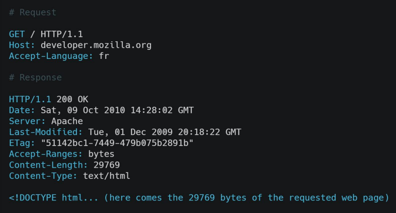
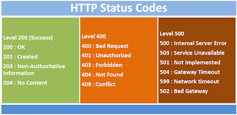
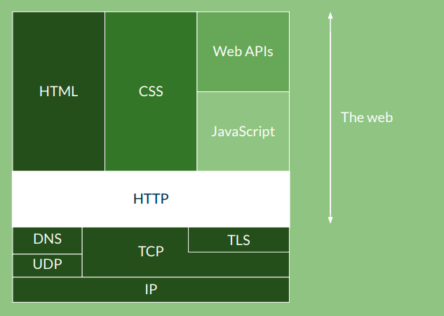
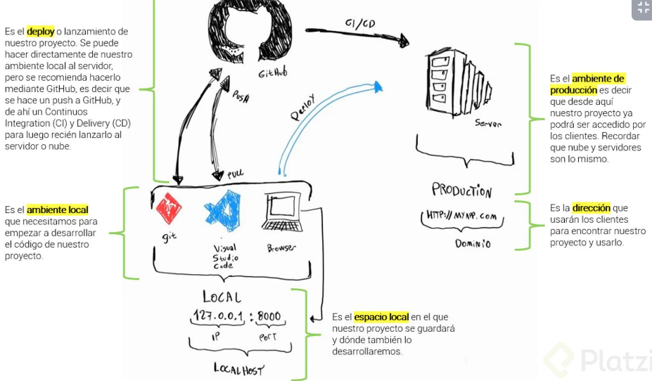

# Curso de Introducción al Desarrollo Backend

https://platzi.com/cursos/introduccion-backend/
prof: Facundo García Martoni

## Yin y Yang de una aplicación: frontend y backend

Las aplicaciones web se componen de:

<u>Frontend</u>:

- Código

HTML (HyperText Markup Language)
CSS (cascade stylesheet) - bootstrap, fundation, tailwind
JS (Javascript) -- Vue, angular, react, svelte
PHP(Hypertext Preprocessor) permite hacer algunas cosas.

- Diseño

UX (Experiencia de usuario)
UI (Interfaz del Usuario) -- Adobe xd, sketch, figma

<u>Backend</u>:

Javascript (Node.js)
PHP -- laravel
JAVA -- spring
GO
Rust
Ruby -- ruby on rails
Python > Fast API, Flask y Django

## Framework vs. librería

Framework: Será la base sobre la cual podras construir y desarrollar tu proyecto, incluye todas las herramientas necesarias para completarlo (incluye librerías, estándares y reglas).

Librería: Solo aborda una utilidad especifica, pudiendo agregar más de una en tu proyecto. Eso si, asegurate que no interfieran con el código de otra librería.

> Recuerda: Ninguno es mejor que el otro, todo va a depender de la necesidad de tu proyecto

## Cómo se conecta el frontend con el backend: API y JSON

La unión entre el Frontend y el Backend se hace a través de una API: Application Programming Interface.

Una API es una sección del backend que permite que el frontend pueda comunicarse con él a través de mensajes bidireccionales (de ida y vuelta).

**Tenemos dos grandes estándares para crear las APIs**:

- SOAP (Simple Objetct Access Protocol): Mueve la información entre Frontend y Backend usando el lenguaje XML (Extensive Markup Language), este lenguaje es muy usado en otras área de TI, como diseño de interfaces de escritorio o móviles. Sin embargo, el uso del protocolo SOAP decae cada vez más por una alternativa más eficiente que es REST.

- REST (REpresentational state transfer): Usa JSON (JavaScript Object Notation) para compatir información entre el Frontend y el Backend, su estructura es identica a los diccionarios en Python, esto se debe a que los diccionarios en Python son iguales a los objetos en Javascript. REST utiliza HTTP y sus verbos para su comunicación.

## El lenguaje que habla Internet: HTTP

## El lenguaje que habla Internet: HTTP

## ¿Cómo es el flujo de desarrollo de una aplicación web?

Entorno local (Editor de Código → Git → mi local) Pasar del entorno local al servidor se llama deploy.

Normalmente se hace un push a un repositorio remoto (Github), el cual es un servidor que solo contiene el código de tu proyecto.

Cada vez que uno trae código de Github a un entorno local es un pull.

Lo que se hace normalmente en un entorno profesional es CI/CD (Continuous Integration and Continuous Delivery) o Continous Deployment. Se prueba (testea), si funciona bien, el código se va a al server (production).

El proyecto se guarda en production en un domain (dominio).

Se puede comprar un dominio, por ejemplo en namecheap.

En mi computadora, las cosas van a vivir en un entorno local:

Dirección y puerto, por ejemplo:
127.0.0.1 : 8000
IP Port

## El hogar de tu código: el servidor

Es una computadora que contiene una aplicación y la distribuye mediante el protocolo HTTP.

<u>La nube</u>: Son servidores juntos que se encuentan en algún lugar del mundo funcionando y distribuyendo aplicaciones.

Estos se encuentran en un sitio llamado Data Centers

<u>Data Centers</u>: Son los lugares donde se encuentran los servidores, los cuales almacenan datos (como tu página web, o una aplicación como Facebook)

<u>Hosting</u>: Es el acto de guardar tu aplicación en un server. Un espacio en un servidor, donde tu aplicación será guardada.

Existen diferentes tipos de hosting (formas de guardar aplicaciones):

- IaaS: Infrastructure as a Service
- PaaS: Platform as a Service
- SaaS: Software as a Service

<u>IaaS</u> Este servicio te da el control de las cosas importantes como

- La cantidad de CPU
- RAM
- SSD

Para esto existen diferentes opciones: AWS, Microsoft Azure, Digital Ocean.

Existen dos tipos de IaaS:

- VPS (Virtual Private Server): Servidor privado, recursos solo para tí.
- Shared Hosting: Compartes los recursos con otras personas.

Investigar AWS, Azure.

<u>PaaS</u> El servidor se asegura de actualizar las aplicaciones que hacen que viva tu aplicación:

- Base de datos
- Seguridad
- Firewall ???
- Qué es un Firewall?

Los firewall o cortafuegos en su traducción, son son programas de software o dispositivos de hardware que filtran y examinan la información que viaja a través de tu conexión a Internet. Representan la primera defensa porque pueden evitar que un programa malicioso o un atacante obtengan acceso a tu red y a tu información antes de que se produzca cualquier posible daño.

Las PaaS tienen una interfaz gráfica que te permite elegir lo que tu app necesita (como una DB o que tipo de Firewall). Creando así un nivel de abstracción donde no tienes que preocuparte de las especificaciones de los servers.

Los PaaS son Just Deploy

Existen diferentes:

- Google APP Engine
- Firebase
- Heroku

<u>SaaS</u>: Es cuando necesitas un software ya hecho.

Es una aplicación que un provedor te presta para que hagas funcionar tu negocio.

No Code

Existen varias opciones:

- Google Docs
- Slack
- WordPress

## Proyecto: diseño y bosquejo de una API

Twitter

Diseñaremos una API como la de twitter.

Framworks: fast api, django, flask

- Endpoint (rote, path): seccion de la url del proyecto. Ej: https://ejemplo.com/api/endpoint1

## Proyecto: diseñando los endpoints de los Tweets

Modelo tweets

<u>Endpoints</u>:

- /tweets -> Show all tweets
- /post -> publish a tweet
- /tweets/{id} -> Show a tweet
- /tweets/{id}/update -> update a tweet
- /tweets/{id}/delete -> delete a tweet

## Proyecto: diseñando los endpoints para los usuarios

Modelo users

<u>Endpoints</u>:

- /users -> Show all users
- /signup -> register a user
- /users/{id} -> Show a user
- /users/{id}/update -> update a user
- /users/{id}/delete -> delete a user

## Qué lenguaje y framework escoger para backend

Python - django, fast api, flask

javascript - express, nest

Php - Laravel, Symfony

Java - Spring

Go - gin, beego

Ruby - Rails
