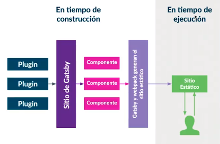

# Desarrollo de Aplicaciones Web con Gatsby JS

https://platzi.com/cursos/gatsby/
Prof: Juan Carlos Correa

<u>Descripción</u>: Desarrolla sitios y aplicaciones web de alto rendimiento con Gatsby, el framework basado en React que te permite estructurar proyectos, interactuar con React, utilizar plugins, crear componentes y manejar estilos. Consume datos de GraphQL en tiempo de construcción en lugar de tiempo de ejecución para llevar tu aplicación a producción en Netlify.

- Instalar y configurar Gatsby desde cero
- Crear vistas de una app web con Gatsby y React
- Conectar tu aplicación en Gatsby a una API en GraphQL
- Crear páginas web programáticamente

## ¿Por qué Gatsby? Seguridad y Velocidad

Al momento de iniciar un proyecto debemos tomar la decisión de qué framework utilizar. Por ejemplo escogemos entre Vue y React.

Estos frmaworks nos crean una <mark>SPA</mark>, con las **desventajas** propias de las SPA.

Generan 1 archivo HTML y múltiples archivos JS que webpack empaqueta en un solo archivo. La **carga inicial es lenta** pero luego la aplicación tiene una nevegación muy fluida ya que posee toda la información en el browser. La segunda desventaja es que **perdemos en SEO**, ya que solo tenemos un .html y no podemos definir título o metadatos para nuestras páginas individuales.

El esquema de <mark>renderizado del lado del servidor</mark> nos ayuda a solucionar esos problemas. Tanto Vue como React poseen soluciones: Nuxt y Next.js.

**Al entregar varios archivos agiliza la carga inicial y el SEO**.

El SSR posee la **desventaja de la lentitud en la navegación** porque tenemos que exigir una nueva página HTML por cada ruta de nuestra aplicación.

<mark>Gatsby</mark> funciona como un generador de sitios estáticos, se apoya de plugins para traer información o funcionalidad y utiliza a React y Graphql para generar la vista.

Cada ruta forma un componente, que luego webpack empaqueta para generar un sitio estático. Para cada vista existe un html.



Gatsby se construye en el servidor apoyándose de NodeJS y de Webpack. También usa los plugins para obtener información de diversas fuentes.

**_Gatsby se apoya en Node utilizando React, Graphql y Webpack para generar el sitio estático. Tennemos un proyecto completo con múltiples archivos html y múltiples archivos js asociados a cada página. Gatsby permite realizar cargas bajo demanda sin realizar nuevas peticiones (recargas en el navegador). Es decir, si el usuario navega a otra página, seguiremos descargando otras secciones en segundo plano. Entonces obtendremos un comportamiento similar a una SPA pero generada desde el lado del servidor_**.

Gatsby se alimenta de datos de diversas fuentes: Firebase, Wrodpress, una API rest o graphql o CMS más modernos. La información se obtiene cuando se construye el sitio en el servidor, es decir, no hay consumo de servicios cuando los usuarios utilizan la aplicación.

Gatsby utiliza tecnologías modernas:


- Virtual DOM
- Componentes React
- Hot Reloading
- Code Splitting (nos ayuda a la carga de páginas en segundo plano que luego serán accedidas por el usuario) e imágenes responsivas. Nos permite la carga de una imágen inicial "borrosa" garantizando el acceso rápido de información al usuario, a medida que se carga el sitio descargará la imágen hasta tenerla a ressolución completa.
- Ya que Gatsby hace un sitio estático es muy fácil hacer el despliegue (netifly o github pages).

Finalmente hay que destacar la seguridad, ya que la app se construye en el server con toda la info y ya no volvemos a utilizar estos servicios en las peticiones.

Documentación: https://www.gatsbyjs.com/

## ¿Qué es Gatsby?

<mark>Gatsby</mark>, también conocido como GatsbyJS, es un framework generador de sitios estáticos que utiliza React, GraphQL y Webpack para construir sitios.

Fue diseñado para permitir a los desarrolladores construir sitios web con React rápidamente. El framework incluye herramientas para crear consultas de datos y transformar esas consultas en componentes reutilizables. Gatsby ahorra tiempo al permitir a los editores de contenido editar el sitio web como lo harían con cualquier otra pieza de contenido sin preocuparse por el código, como lo harían con un CMS.

Gatsby fue diseñado originalmente como starter project de React, pero desde entonces ha ganado mucha popularidad y ahora soporta otras bibliotecas y tecnologías como Webpack y GraphQL, lo que lo hace más poderoso que un simple proyecto inicial.

**<u>Ventajas de Gatsby</u>**

- Gatsby es un framework open source increíblemente rápido, tanto en desarrollo como en producción. Trabaja con un stack innovador, ya que integra tecnologías como React y GraphQL con diferentes fuentes de información como WordPress o Sanity.io.  
  <br>
- Gatsby usa GraphQL para recolectar la información de nuestro sitio web desde diferentes fuentes: APIs, CMS o nuestro sistema de archivos. Y teniendo lista la información, renderiza nuestras vistas en React.js para construir sitios estáticos muy optimizados.

**<u>Aplicaciones web construidas con Gatsby</u>**

Entre muchas otras aplicaciones, la documentación oficial de React.js está construida con Gatsby: Reactjs.org. También la página de comercio electrónico de la marca Braun está hecha en Gatsby. Puedes ver toda una colección de páginas construidas en Gatsby en su showcase.

## Diferencias entre SPA, SSR y Gatsby

Gatsby no solo es rápido, también es seguro.

Para entenderlo mejor debes conocer las diferencias entre Server Side Render y Single Page Applications.

<u>React en Single Page Applications</u> Este tipo de aplicaciones es muy común cuando trabajamos con React.js.

Las SPAs son páginas que siempre cargan el mismo archivo HTML. Este, a su vez, carga un archivo gigante de JavaScript con toda la lógica de nuestra apliacación (por ejemplo, usando React.js).

Estas páginas tienen una carga inicial lenta, ya que no podremos ver la información importante hasta que termine de cargar el archivo de JavaScript. Pero una vez termina la carga inicial, las SPAs son muy rápidas, incluso al navegar por diferentes secciones de nuestra aplicación.

Como el archivo de JavaScript tiene todo el código de nuestra aplicación, el tiempo de navegación pasa de segundos a milisegundos. No necesitamos hacer más requests al servidor. Pero en mucho casos debemos esperar algunos segundos para que termine la carga inicial y podamos utilizar la aplicación.

<u>React en Server Side Rendering</u> Diferentes herramientas como Next.js nos ayudan a utilizar React en el servidor para no afectar el SEO y disminuir el tiempo de carga de nuestra aplicación, todo esto sin perder interactividad.

El Server Side Rendering tradicional es muy común en aplicaciones construidas con WordPress, por ejemplo. Aunque estas páginas tienen un tiempo de carga muy corto, la carga debe repetirse cada vez que el usuario navega por nuestra aplicación, es decir, casi todas las veces que damos click en un link o botón.

**_Las herramientas de SSR con React.js son muy conscientes de este problema, por lo que convierten nuestra aplicación en una SPA inmediatamente después de que termina la carga inicial. Es decir, utilizan SSR en la primera carga y luego se convierten en SPAs para mejorar la navegación e interactividad de nuestro sitio_**.

<u>React en Gatsby: lo mejor de ambos mundos</u>

Gatsby es un generador de sitios estáticos. Esto quiere decir que en vez de renderizar desde el servidor, lo que sucede cada vez que un usuario entra a nuestra aplicación, Gatsby renderiza el contenido solo una vez en la etapa de desarrollo. Nuestro servidor no debe renderizar todo el tiempo, solo envía el HTML inicial (ya renderizado) para que más adelante el navegador se encargue de cargar el código JavaScript que nos ayudará a que nuestra página funcione como una SPA.

**_De esta forma obtenemos todos los beneficios: por ser una SPA, seguimos teniendo una alta interactividad y navegación muy rápida, y además, conseguimos una carga inicial muy rápida, en algunos casos incluso superior a la del SSR_**.

<u>Gatsby vs. WordPress</u> Gatsby también nos ayuda a consumir información desde un CMS como WordPress. De esta forma podemos editar nuestro contenido desde una plataforma que ya conocemos sin que esto afecte al rendimiento de nuestra aplicación.

## Gatsby y Gatsby CLI y Starters

Crea tu primer sitio web en Gatsby. Tenemos dos formas de instalar Gatsby y crear nuestros proyectos.

1. A mano: Debemos crear las carpetas y archivos de nuestro proyecto siguiendo las prácticas de Gatsby. También debemos instalar las dependencias:

```bash
mkdir my-project
cd my-project
npm init -y
npm install --save react react-dom gatsby

# editar package.json ya agregar el siguiente script
develop: "gatsby develop",

# Generar las carpetas src y adentro la carpeta pages.
# En pages generar el archivo index.js
```

```javascript
// index.js
export default function index() {
  return (
    <div>
      <h1>Mi primer sitio Gatsby</h1>
    </div>
  );
}
```

Ejecuamos el proyect con: npm run `develop`

Accedemos al sitio: http://localhost:8000/

2. De forma global: Usamos gatsby-cli para generar un proyecto básico de Gatsby. No debemos crear los archivos ni las carpetas, solo ejecutar los siguientes comandos:

```bash
# No olvides instalar:
npm install -g gatsby-cli

gatsby new gatsbycliproject

# Ahora sí:
gatsby develop
```

<u>Starters</u> La comunidad alrededor de Gatsby es increíble.

Los starters son proyectos creados con el fin de modificar el contenido y tener nuestro sitio listo sin necesidad de hacer configuraciones. Solo debemos copiar el nombre del starter y ejecutar el siguiente comando:

`gatsby new tu-proyecto creador/nombre-del-starter`

Listado de starters: https://www.gatsbyjs.com/starters/

Hay proyectos para blog, para CMS, para portfolios

## Configuración de ESLint

<u>¿Qué es ESLint?</u> ESLint es una herramienta de linting para Javascript. Un linter es un programa que se encarga de revisar el código escrito y es capaz de señalar errores y posibles bugs que podemos corregir para mejorar nuestros programas, de esta manera tenemos acceso a los errores incluso antes de que sucedan.

<u>¿Por qué usar ESLint?</u> Gracias a que JavaScript es un lenguaje dinámico y débilmente tipado, especialmente propenso a errores por parte del programador es que ESLint es muy útil. Esta herramienta nos ayuda a prevenir la manera de antaño para encontrar errores en este lenguaje.

El objetivo de ESLint es encontrar errores mucho antes de que sucedan, de manera automática y sin necesidad de ejecutar el código. Esto nos permite reparar los errores muy rápido y agilizar nuestro tiempo de desarrollo.

ESLint está basado en reglas configurables y viene con un conjunto preestablecido que podemos usar como punto de inicio y más adelante poder habilitar o deshabilitar ciertas reglas considerando nuestro estilo de código o incluso una convención en nuestro equipo de desarrollo.

<u>ESLint y Gatsby</u> Gatsby incluye una configuración integrada de ESLint. Para la mayoría de los usuarios, la configuración incorporada de ESLint es todo lo que necesita. Sin embargo, si tienes una configuración personalizada o una convención en tu equipo de trabajo podemos configurarlo.

<u>Instalación</u> Ya que Gatsby viene con ESLint configurado de base podemos añadir nuestra configuración inicializando desde la herramienta en node_modules:

`./node_modules/.bin/eslint --init`

Este comando va a lanzar un proceso de ayuda para configurar ESLint paso a paso, revisemos los elementos:

1. ¿Con qué objetivo vamos a usar ESLint?

How would you like to use ESLint?

- [ ] To check sintax only
- [x] To check sintax and find problems
- [ ] To check sintax, find problems and enforce code style

2. ¿Qué tipo de módulos va a utilizar nuestro proyecto?

What type of modules does your project use?

- [x] JavaScript modules (import/export)
- [ ] CommonJS (import/export)
- [ ] None of these

3. ¿Qué Framework/Biblioteca va a usar nuestro proyecto?

Wich framework does your project use?

- [x] React
- [ ] Vue.js
- [ ] None of these

4. ¿En qué entorno corre nuestro proyecto?

Where does your code run?

- [x] Browser
- [x] Node

5. ¿En qué formato deseas el archivo de configuración?
   What formar do you want your config file to be in?

- [x] JavaScritp
- [ ] YAML
- [ ] JSON

6. Por último, Hace falta una dependencia para trabajar con el estándar de JavaScript, ¿quieres instalarla ahora?
   The config that you've selected requires the following dependencies:

```
eslint-plugin-react@latest eslint@latest
Would you like to install them now with npm? (Y/n)
```

Continúa con Y, esto va a instalar una herramienta que nos va a permitir trabajar con React.

El resultado de este proceso es un archivo llamado .eslintrc.js con el siguiente contenido:

```javascript
module.exports = {
  env: {
    browser: true,
    es6: true,
    node: true,
  },
  extends: "eslint:recommended",
  globals: {
    Atomics: "readonly",
    SharedArrayBuffer: "readonly",
  },
  parserOptions: {
    ecmaFeatures: {
      jsx: true,
    },
    ecmaVersion: 2018,
    sourceType: "module",
  },
  plugins: ["react"],
  rules: {},
};
```

Vamos a cambiar la propiedad extends, que nos ayuda a heredar una serie de configuraciones pre establecidas y recomendadas. El proceso de init nos ayudó a instalar un plugin para react, vamos a heredar de él en extends.

```javascript
"extends": [
    "eslint:recommended",
    "plugin:react/recommended"
  ]
```

Por último, vamos a revisar la opción de rules, esta sección nos permite configurar reglas en particular. Podemos habilitar o deshabilitar reglas para el linter, por ejemplo, que nos notifique con un error o advertencia si no colocamos los punto y coma en el proyecto.

```javascript
"rules": {
    "semi": "warning",
  },
```

Gracias a que tenemos configurado el plugin de React y React busca mejores prácticas también hay reglas orientadas al desarrollo de React, podemos modificarlas de igual manera, por ejemplo, remover la linterna para prop-types:

```javascript
"rules": {
    "semi": "off",
    "react/prop-types": 0,
    "react/display-name": 0,
  },
```

Esta es la manera de configurar ESLint de manera manual, recuerda que la herramienta nos ayuda a prevenir errores incluso antes de ejecutar el código y ver los errores en consola.
