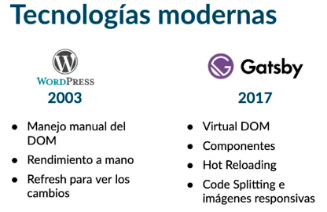

# Desarrollo de Aplicaciones Web con Gatsby JS

https://platzi.com/cursos/gatsby/
Prof: Juan Carlos Correa

<u>Descripción</u>: Desarrolla sitios y aplicaciones web de alto rendimiento con Gatsby, el framework basado en React que te permite estructurar proyectos, interactuar con React, utilizar plugins, crear componentes y manejar estilos. Consume datos de GraphQL en tiempo de construcción en lugar de tiempo de ejecución para llevar tu aplicación a producción en Netlify.

- Instalar y configurar Gatsby desde cero
- Crear vistas de una app web con Gatsby y React
- Conectar tu aplicación en Gatsby a una API en GraphQL
- Crear páginas web programáticamente

## ¿Por qué Gatsby? Seguridad y Velocidad

Al momento de iniciar un proyecto debemos tomar la decisión de qué framework utilizar. Por ejemplo escogemos entre Vue y React. 

Estos frmaworks nos crean una <mark>SPA</mark>, con las **desventajas** propias de las SPA. 

Generan 1 archivo HTML y múltiples archivos JS que webpack empaqueta en un solo archivo. La **carga inicial es lenta** pero luego la aplicación tiene una nevegación muy fluida ya que posee toda la información en el browser. La segunda desventaja es que **perdemos en SEO**, ya que solo tenemos un .html y no podemos definir título o metadatos para nuestras páginas individuales.

El esquema de <mark>renderizado del lado del servidor</mark> nos ayuda a solucionar esos problemas. Tanto Vue como React poseen soluciones: Nuxt y Next.js. 

**Al entregar varios archivos agiliza la carga inicial y el SEO**.

El SSR posee la **desventaja de la lentitud en la navegación** porque tenemos que exigir una nueva página HTML por cada ruta de nuestra aplicación.

<mark>Gatsby</mark> funciona como un generador de sitios estáticos, se apoya de plugins para traer información o funcionalidad y utiliza a React y Graphql para generar la vista. 

Cada ruta forma un componente, que luego webpack empaqueta para generar un sitio estático. Para cada vista existe un html. 

Gatsby se construye en el servidor apoyándose de NodeJS y de Webpack. También usa los plugins para obtener información de diversas fuentes.

***Gatsby se apoya en Node utilizando React, Graphql y Webpack para generar el sitio estático. Tennemos un proyecto completo con múltiples archivos html y múltiples archivos js asociados a cada página. Gatsby permite realizar cargas bajo demanda sin realizar nuevas peticiones (recargas en el navegador). Es decir, si el usuario navega a otra página, seguiremos descargando otras secciones en segundo plano. Entonces obtendremos un comportamiento similar a una SPA pero generada desde el lado del servidor***. 

Gatsby se alimenta de datos de diversas fuentes: Firebase, Wrodpress, una API rest o graphql o CMS más modernos. La información se obtiene cuando se construye el sitio en el servidor, es decir, no hay consumo de servicios cuando los usuarios utilizan la aplicación. 

Gatsby utiliza tecnologías modernas:

- Virtual DOM
- Componentes React
- Hot Reloading
- Code Splitting (nos ayuda a la carga de páginas en segundo plano que luego serán accedidas por el usuario) e imágenes responsivas. Nos permite la carga de una imágen inicial "borrosa" garantizando el acceso rápido de información al usuario, a medida que se carga el sitio descargará la imágen hasta tenerla a ressolución completa.
- Ya que Gatsby hace un sitio estático es muy fácil hacer el despliegue (netifly o github pages).

Finalmente hay que destacar la seguridad, ya que la app se construye en el server con toda la info y ya no volvemos a utilizar estos servicios en las peticiones.

Documentación: https://www.gatsbyjs.com/

## ¿Qué es Gatsby?

<mark>Gatsby</mark>, también conocido como GatsbyJS, es un framework generador de sitios estáticos que utiliza React, GraphQL y Webpack para construir sitios.

Fue diseñado para permitir a los desarrolladores construir sitios web con React rápidamente. El framework incluye herramientas para crear consultas de datos y transformar esas consultas en componentes reutilizables. Gatsby ahorra tiempo al permitir a los editores de contenido editar el sitio web como lo harían con cualquier otra pieza de contenido sin preocuparse por el código, como lo harían con un CMS.

Gatsby fue diseñado originalmente como starter project de React, pero desde entonces ha ganado mucha popularidad y ahora soporta otras bibliotecas y tecnologías como Webpack y GraphQL, lo que lo hace más poderoso que un simple proyecto inicial.

**<u>Ventajas de Gatsby</u>**

- Gatsby es un framework open source increíblemente rápido, tanto en desarrollo como en producción. Trabaja con un stack innovador, ya que integra tecnologías como React y GraphQL con diferentes fuentes de información como WordPress o Sanity.io.  
 
- Gatsby usa GraphQL para recolectar la información de nuestro sitio web desde diferentes fuentes: APIs, CMS o nuestro sistema de archivos. Y teniendo lista la información, renderiza nuestras vistas en React.js para construir sitios estáticos muy optimizados.

**<u>Aplicaciones web construidas con Gatsby</u>**

Entre muchas otras aplicaciones, la documentación oficial de React.js está construida con Gatsby: Reactjs.org. También la página de comercio electrónico de la marca Braun está hecha en Gatsby. Puedes ver toda una colección de páginas construidas en Gatsby en su showcase.

## Diferencias entre SPA, SSR y Gatsby

Gatsby no solo es rápido, también es seguro.

Para entenderlo mejor debes conocer las diferencias entre Server Side Render y Single Page Applications.

<u>React en Single Page Applications</u> Este tipo de aplicaciones es muy común cuando trabajamos con React.js.

Las SPAs son páginas que siempre cargan el mismo archivo HTML. Este, a su vez, carga un archivo gigante de JavaScript con toda la lógica de nuestra apliacación (por ejemplo, usando React.js).

Estas páginas tienen una carga inicial lenta, ya que no podremos ver la información importante hasta que termine de cargar el archivo de JavaScript. Pero una vez termina la carga inicial, las SPAs son muy rápidas, incluso al navegar por diferentes secciones de nuestra aplicación.

Como el archivo de JavaScript tiene todo el código de nuestra aplicación, el tiempo de navegación pasa de segundos a milisegundos. No necesitamos hacer más requests al servidor. Pero en mucho casos debemos esperar algunos segundos para que termine la carga inicial y podamos utilizar la aplicación.

<u>React en Server Side Rendering</u> Diferentes herramientas como Next.js nos ayudan a utilizar React en el servidor para no afectar el SEO y disminuir el tiempo de carga de nuestra aplicación, todo esto sin perder interactividad.

El Server Side Rendering tradicional es muy común en aplicaciones construidas con WordPress, por ejemplo. Aunque estas páginas tienen un tiempo de carga muy corto, la carga debe repetirse cada vez que el usuario navega por nuestra aplicación, es decir, casi todas las veces que damos click en un link o botón.

***Las herramientas de SSR con React.js son muy conscientes de este problema, por lo que convierten nuestra aplicación en una SPA inmediatamente después de que termina la carga inicial. Es decir, utilizan SSR en la primera carga y luego se convierten en SPAs para mejorar la navegación e interactividad de nuestro sitio***.

<u>React en Gatsby: lo mejor de ambos mundos</u>

Gatsby es un generador de sitios estáticos. Esto quiere decir que en vez de renderizar desde el servidor, lo que sucede cada vez que un usuario entra a nuestra aplicación, Gatsby renderiza el contenido solo una vez en la etapa de desarrollo. Nuestro servidor no debe renderizar todo el tiempo, solo envía el HTML inicial (ya renderizado) para que más adelante el navegador se encargue de cargar el código JavaScript que nos ayudará a que nuestra página funcione como una SPA.

***De esta forma obtenemos todos los beneficios: por ser una SPA, seguimos teniendo una alta interactividad y navegación muy rápida, y además, conseguimos una carga inicial muy rápida, en algunos casos incluso superior a la del SSR***.

<u>Gatsby vs. WordPress</u> Gatsby también nos ayuda a consumir información desde un CMS como WordPress. De esta forma podemos editar nuestro contenido desde una plataforma que ya conocemos sin que esto afecte al rendimiento de nuestra aplicación.